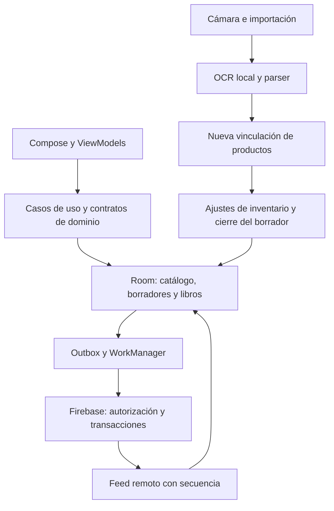

**Análisis técnico de FacturaStock — 3 de septiembre de 2026**

La implementación tiene una base considerable de persistencia, validación y pruebas. Sin embargo, el estado actual presenta errores de integridad en el nuevo ingreso de inventario desde OCR y problemas en sincronización y compilación limpia. Mi recomendación es corregir esos recorridos antes de utilizarlos con existencias reales o promover esta revisión a distribución.

La revisión comprende el árbol de trabajo de `/Users/gustavo/Desktop/ProyectoMayda`, incluido el código sin commit, sobre el snapshot `0b2f23d`. Al comenzar había 74 entradas modificadas o nuevas, contando individualmente los archivos no versionados. Se revisaron arquitectura, Gradle/CI, persistencia, dominio, captura/OCR, navegación, backend, reglas y documentación, con revisiones paralelas de esas áreas. No se modificó código funcional. No es una afirmación de haber revisado exhaustivamente cada línea ni una certificación de seguridad.

**Qué producto hay realmente**

FacturaStock es una aplicación Android nativa en español que combina catálogos, captura de comprobantes, OCR local, compras, inventario, ventas, cuentas por cobrar y reportes. Kotlin, Compose, Hilt, Room y WorkManager forman el cliente; Firebase Auth, Firestore, Functions y Storage implementan las capacidades remotas. El repositorio declara dos módulos Gradle: `app` y `benchmark`. Las capas de negocio viven principalmente en paquetes dentro de `app`, no en módulos compilados por separado.

Hay dos flavors, `local` y `cloud`, y una variante adicional `cloudSpark`. En local, Room es la autoridad del negocio y se elimina el permiso de Internet. En un negocio cloud enlazado, el inventario compartido y las ventas dependen de autorización remota; una venta sin red no debe convertirse automáticamente en una venta local. Spark añade otra implementación de operaciones remotas con escrituras directas y reglas específicas, por lo que también necesita su propia evidencia de integración.

El flujo histórico de compras conserva revisión, preparación, publicación y trazabilidad. El flujo principal recientemente modificado lleva la foto a OCR y a una pantalla nueva de vinculación que agrega existencias mediante movimientos `ADJUSTMENT` y elimina el borrador. Esa diferencia explica buena parte de los hallazgos: el nuevo recorrido mueve inventario sin conservar todas las validaciones y garantías del recorrido histórico.



El tamaño ya exige disciplina de mantenimiento: 521 archivos Kotlin y 115.686 líneas en `app/src/main`, 41 archivos y 11.422 líneas en `cloud`, 14 archivos y 473 líneas en `local`; 11 archivos JavaScript productivos de backend suman 7.774 líneas. Las fuentes de pruebas incluyen 197 archivos JVM comunes, 22 de cloud, 90 instrumentados comunes y dos instrumentados cloud. Son conteos de archivos y líneas, no medidas de calidad o cobertura. Room está en versión 27 y declara 32 entidades.

**Lo que está bien construido**

- El dominio conserva dinero en unidades menores y usa `BigDecimal` para cantidades y costos, con políticas explícitas de precisión, redondeo y moneda.
- El recorrido histórico de publicación agrupa compra, líneas, inventario, movimientos, auditoría y outbox en una transacción y comprueba el preparado mediante hashes e identidad documental.
- Room tiene migraciones explícitas, WAL, controles de integridad, CAS y restricciones sobre datos publicados. La apertura ante corrupción preserva la base; no encontré una migración destructiva en los caminos revisados.
- Captura y OCR conservan identificadores y tokens durables. El OCR revalida qué ejecución puede publicar, evita resultados parciales y diferencia cancelación de error.
- Hay trabajo concreto sobre privacidad: imágenes retenidas con AES-GCM/AndroidKeyStore, copias automáticas del sistema desactivadas, `FLAG_SECURE`, telemetría inicialmente apagada y restricciones sobre logs y artefactos publicados. Esto no equivale a que toda la base Room esté cifrada.
- La CI contempla reglas Firebase, pruebas de dominio, migraciones, UI, cobertura, macros de rendimiento, firma y validación de artefactos. Las Actions están fijadas a SHA y las dependencias a versiones. La intención es buena, aunque el hallazgo 1 impide cumplirla en una configuración limpia.

**Hallazgos que requieren corrección prioritaria**

`P1` significa corregir antes de publicar o confiar en el recorrido afectado; `P2` identifica un problema funcional o de calidad que debe resolverse después de los bloqueos. Distingo reproducciones ejecutadas de escenarios confirmados por trazado de código.

**1. [P1, reproducido] Compilar local exige configuración Firebase de Spark.**

`preBuild` depende de `verifyOfflineFirstBoundaries`; ese gate depende incondicionalmente de `verifyCloudSparkBoundaries`, que exige proyecto, App ID y API key. Se ejecutó `:app:preBuild` en una configuración temporal con solo `sdk.dir`, sin cambiar el `local.properties` del usuario. Falló con `cloudSpark requiere firebase.projectId en local.properties`.

Esto contradice el setup sin cuentas ni credenciales del README. El job `quality` de la CI tampoco recibe esos valores, por lo que la misma dependencia lo afecta. Que la compilación pase en este equipo configurado no valida el arranque desde cero.

Corrección: separar las comprobaciones estáticas de aislamiento de las comprobaciones de configuración de una variante; exigir los valores de Spark únicamente en las tareas de esa variante. Validar otra vez `assembleLocalDebug` y el job de calidad sin valores Firebase.

Referencias: [dependencia cruzada](/Users/gustavo/Desktop/ProyectoMayda/app/build.gradle.kts:2087), [valores obligatorios](/Users/gustavo/Desktop/ProyectoMayda/app/build.gradle.kts:1593), [preBuild](/Users/gustavo/Desktop/ProyectoMayda/app/build.gradle.kts:2352). Evidencia: [salida de configuración limpia](/tmp/facturastock-audit-clean-build.log).

**2. [P1, reproducido] Un lote mixto puede perder una línea sin cantidad.**

La pantalla permite guardar cuando todas las descripciones están vinculadas y alguna fila tiene cantidad positiva. El caso de uso omite las filas con cantidad nula o no positiva y después elimina el borrador completo.

Reproducción con las clases productivas compiladas y repositorios de prueba: dos productos vinculados, uno con cantidad y otro sin ella, devolvieron `Applied(updatedCount=1)`, una sola entrada de inventario y `draftAfter=null`. La interfaz cuenta productos vinculados como listos, pero no ofrece edición de cantidad para un producto existente. Se pierde la oportunidad de recuperar la fila omitida desde ese borrador.

Corrección: exigir cantidad validada por cada fila relevante, permitir corregirla y registrar cualquier descarte como decisión explícita. Probar el lote mixto; la prueba de todas las cantidades ausentes no cubre este caso.

Referencias: [habilitación de guardar](/Users/gustavo/Desktop/ProyectoMayda/app/src/main/java/com/facturastock/app/feature/matching/InvoiceMatchingContract.kt:30), [filtrado y borrado](/Users/gustavo/Desktop/ProyectoMayda/app/src/main/java/com/facturastock/app/domain/usecase/ConfirmInvoiceMatchingUseCase.kt:74).

**3. [P1, reproducido] Se confunde unidad de compra con unidad de inventario.**

El nuevo modelo de matching conserva el número de cantidad, pero pierde la unidad leída. El ingreso suma directamente ese número. No utiliza la relación `purchaseUnitId`/`purchaseFactor` que ya existe en `Product`, ni solicita resolverla.

Se ejecutó el caso de dos cajas con factor 12: el caso de uso solicitó sumar 2, cuando corresponde resolver una entrada de 24 unidades base. También conserva el costo por caja como si fuera costo por unidad. Multiplicar siempre por el factor tampoco sería correcto: primero hay que distinguir una factura expresada en caja de una expresada en unidad base.

Corrección: transportar la unidad OCR, validar la conversión y presentar cantidad y costo por unidad base antes de confirmar.

Referencias: [pérdida de unidad](/Users/gustavo/Desktop/ProyectoMayda/app/src/main/java/com/facturastock/app/domain/usecase/MatchScannedInvoiceLinesUseCase.kt:40), [cantidad aplicada](/Users/gustavo/Desktop/ProyectoMayda/app/src/main/java/com/facturastock/app/domain/usecase/ConfirmInvoiceMatchingUseCase.kt:79), [contrato del factor](/Users/gustavo/Desktop/ProyectoMayda/app/src/main/java/com/facturastock/app/domain/model/CatalogModels.kt:77).

**4. [P1, reproducido] El costo pierde su moneda y adopta la configuración del negocio.**

`MatchScannedInvoiceLinesUseCase` extrae `.amount` de `UnitCost` y descarta la moneda. `ConfirmInvoiceMatchingUseCase` envía el costo numérico junto a `config.currency`. La proyección del parser sí conservaba la moneda.

La reproducción leyó un costo `24.00 USD` y terminó solicitando un ajuste de inventario con `unitCost=24.00` e `inventoryCurrency=PEN`. No hubo rechazo ni conversión.

Corrección: conservar `UnitCost` o moneda explícita y bloquear una incompatibilidad hasta que exista una resolución validada. Debe mantenerse el control monetario que ya tiene el resto del dominio.

Referencias: [extracción del importe](/Users/gustavo/Desktop/ProyectoMayda/app/src/main/java/com/facturastock/app/domain/usecase/MatchScannedInvoiceLinesUseCase.kt:42), [moneda aplicada](/Users/gustavo/Desktop/ProyectoMayda/app/src/main/java/com/facturastock/app/domain/usecase/ConfirmInvoiceMatchingUseCase.kt:93). Evidencia conjunta de 2–4: [harness Java](/tmp/facturastock-audit-ui/MatchingAudit.java), [salida](/tmp/facturastock-audit-ui/result.txt). Se probaron casos de uso productivos con repositorios falsos; no se presenta como ejecución de interfaz ni SQLite.

**5. [P1, trazado de código] Editar stock desde catálogo puede divergir del inventario cloud.**

Guardar un producto con cantidad llama a `setStock` sin comprobar si el negocio está enlazado. El repositorio modifica saldo y movimiento local, sin operación remota ni outbox para ese ajuste. El feed remoto posteriormente reemplaza ese saldo.

Escenario: un negocio compartido tiene 10 unidades; en un teléfono se edita a 20. El otro sigue en 10 y un hecho remoto posterior puede sobrescribir las 20 del primero. El nuevo matching sí bloquea expresamente ajustes en negocios cloud; catálogo no aplica esa misma regla.

Corrección: controlar la autoridad de inventario dentro de la operación de dominio/repositorio. Implementar ajuste remoto idempotente o impedir editar existencias cloud hasta que exista.

Referencias: [ruta de catálogo](/Users/gustavo/Desktop/ProyectoMayda/app/src/main/java/com/facturastock/app/feature/catalogs/CatalogsViewModel.kt:630), [ajuste local](/Users/gustavo/Desktop/ProyectoMayda/app/src/main/java/com/facturastock/app/data/repository/RoomProductInventoryRepository.kt:60), [aplicación remota](/Users/gustavo/Desktop/ProyectoMayda/app/src/main/java/com/facturastock/app/data/repository/RoomSharedInventoryApplicationRepository.kt:339).

**6. [P1, trazado de código] La confirmación del matching no cierra el borrador atómicamente.**

Crear productos, aplicar inventario, guardar aliases y eliminar el borrador son operaciones separadas. Si el proceso se cancela o falla el borrado después del commit de inventario, el borrador sigue disponible aunque el stock ya haya entrado.

La clave idempotente incluye el producto elegido. Religar la misma fila de A a B antes del reintento crea otra clave: se agrega stock a B sin revertir A. Con el mismo producto, corregir cantidad, costo o ubicación conserva la clave anterior y el repositorio devuelve éxito sin comparar el contenido. La idempotencia protege solo una repetición idéntica de la selección, no el ciclo completo de recuperación.

Corrección: sellar las decisiones mediante un recibo durable; confirmar inventario y cierre lógico del borrador en una transacción, dejando la limpieza física de archivos como trabajo posterior. El replay debe validar el contenido íntegro.

Referencias: [orden de operaciones y clave](/Users/gustavo/Desktop/ProyectoMayda/app/src/main/java/com/facturastock/app/domain/usecase/ConfirmInvoiceMatchingUseCase.kt:84), [replay sin comparación](/Users/gustavo/Desktop/ProyectoMayda/app/src/main/java/com/facturastock/app/data/repository/RoomProductInventoryRepository.kt:163).

**7. [P1, trazado de código] Un checkout remoto de resultado incierto permite editar el carrito y atascar el pull.**

La venta se publica remotamente antes del commit Room. Una respuesta perdida se convierte en `OnlineRequired`; no se persiste un estado de confirmación pendiente que congele ese contenido. La UI protege la operación mientras está en curso, pero esa protección termina al recibir el error.

Si el servidor confirmó y el usuario cambia el carrito antes de recuperar la venta, el retry con el mismo identificador tiene otro hash y es rechazado. El aplicador remoto también exige que líneas, versión y totales del borrador coincidan. Si no coinciden, rechaza la página y no avanza el cursor, afectando hechos posteriores. No ejecuté un corte de red de extremo a extremo; la secuencia se identifica en las ramas productivas.

Corrección: guardar una intención durable con payload congelado antes de la llamada; consultar/reintentar esa identidad hasta conocer el resultado. Si hay ediciones posteriores, conservarlas en otro carrito.

Referencias: [checkout y error ambiguo](/Users/gustavo/Desktop/ProyectoMayda/app/src/main/java/com/facturastock/app/data/repository/RoomSaleRepository.kt:459), [rechazo del borrador divergente](/Users/gustavo/Desktop/ProyectoMayda/app/src/main/java/com/facturastock/app/data/repository/RoomSharedInventoryApplicationRepository.kt:499), [replay Spark](/Users/gustavo/Desktop/ProyectoMayda/app/src/cloud/java/com/facturastock/app/data/spark/SparkRemoteSaleSyncRepository.kt:623).

**8. [P2, reproducido en emulador] Más de 100 movimientos impiden abrir stock del producto en otro almacén.**

Al inicializar un saldo ausente, el backend consulta hasta 101 movimientos del producto y rechaza si encuentra más de 100. Ese límite se aplica aunque todos sean movimientos modernos de otro almacén. Un negocio iniciado por compras v4 no recibe automáticamente el marcador de migración terminada que evita el chequeo; el bootstrap de recuperación rechaza un inventario ya inicializado.

Reproducción con operaciones normales en `demo-facturastock`: 101 compras v4 del mismo producto en A se registraron; la siguiente en B devolvió `INVENTORY_HISTORY_SCAN_LIMIT`; intentar bootstrap devolvió `INVENTORY_ALREADY_INITIALIZED`.

Corrección: distinguir mediante estado durable los negocios inicializados con el modelo actual de los que requieren migración. El crecimiento de historia válida no debe activar una condición sin recuperación. Añadir una regresión que supere el límite entre dos almacenes.

Referencias: [consulta limitada](/Users/gustavo/Desktop/ProyectoMayda/functions/inventorySync.js:471), [bootstrap bloqueado](/Users/gustavo/Desktop/ProyectoMayda/functions/inventoryBootstrap.js:392). Evidencia: [reproducción Firebase](/tmp/facturastock-audit-backend-repro.log).

**9. [P1, reproducido en emulador] Una llamada fallida puede borrar un respaldo documental ya confirmado.**

Dos llamadas concurrentes pueden subir la misma imagen. Si una confirma y la otra falla posteriormente al revalidar membresía, el `catch` de `finalizeReservedDocumentUpload` elimina el objeto compartido sin respetar el `COMPLETE` que otra llamada ya confirmó.

Se reprodujo con Firestore y Storage del emulador, controlando el orden al pausar el retorno de una escritura. La segunda llamada confirmó; la primera perdió membresía antes de finalizar y devolvió `NOT_A_MEMBER`. Después, el objeto estaba ausente pero su marcador seguía en `COMPLETE`. El reintento del miembro vigente devolvió éxito y tampoco restauró los bytes. No se probó contra producción.

Corrección: condicionar la limpieza al estado durable y a la propiedad de la operación, protegiendo una publicación confirmada por otro intento. Definir recuperación para un replay de `COMPLETE` cuyo objeto falte.

Referencias: [revalidación](/Users/gustavo/Desktop/ProyectoMayda/functions/documentBackup.js:783), [borrado tras cualquier fallo](/Users/gustavo/Desktop/ProyectoMayda/functions/documentBackup.js:802), [replay de COMPLETE](/Users/gustavo/Desktop/ProyectoMayda/functions/documentBackup.js:939). Evidencia: [resultado de carrera](/tmp/facturastock-audit-backend-upload-race.log).

**Problemas funcionales adicionales**

| Prioridad | Problema observado en código | Consecuencia y corrección |
| --- | --- | --- |
| P2 | Un ingreso sin costo crea un saldo con promedio cero y rentabilidad disponible. | Registrar 10 unidades a precio 5 sin costo puede mostrar 50 de beneficio potencial y margen 100 %. Distinguir costo desconocido de costo explícitamente cero. [Cálculo de saldo](/Users/gustavo/Desktop/ProyectoMayda/app/src/main/java/com/facturastock/app/data/repository/RoomProductInventoryRepository.kt:181), [rentabilidad](/Users/gustavo/Desktop/ProyectoMayda/app/src/main/java/com/facturastock/app/data/repository/RoomProductProfitRepository.kt:131). |
| P2 | Links manuales, nuevos productos preparados y cantidades del matching solo viven en memoria. | La muerte del proceso pierde decisiones de una factura revisada. Guardar un snapshot con revisión/CAS y claves de línea estables. [Estado inicial](/Users/gustavo/Desktop/ProyectoMayda/app/src/main/java/com/facturastock/app/feature/matching/InvoiceMatchingViewModel.kt:61), [edición en memoria](/Users/gustavo/Desktop/ProyectoMayda/app/src/main/java/com/facturastock/app/feature/matching/InvoiceMatchingViewModel.kt:178). |
| P2 | Volver desde matching reabre OCR terminado, con efecto terminal ya emitido. | Se dibuja una carga sin trabajo activo ni botón para continuar. Retirar procesamiento del back stack o representar su estado completado. [Navegación](/Users/gustavo/Desktop/ProyectoMayda/app/src/main/java/com/facturastock/app/navigation/FacturaStockApp.kt:1265), [pantalla OCR](/Users/gustavo/Desktop/ProyectoMayda/app/src/main/java/com/facturastock/app/feature/ocr/OcrRoute.kt:271). |
| P2 | La búsqueda de productos usa una coroutine principal sin manejo del error de repositorio. | Un fallo de lectura puede escapar como excepción no controlada. Capturar errores por solicitud, conservar el colector y ofrecer reintento. [Colector](/Users/gustavo/Desktop/ProyectoMayda/app/src/main/java/com/facturastock/app/feature/matching/InvoiceMatchingViewModel.kt:72), [consulta](/Users/gustavo/Desktop/ProyectoMayda/app/src/main/java/com/facturastock/app/feature/matching/InvoiceMatchingViewModel.kt:163). |
| P2 | Crear producto toma la primera unidad activa de una página de cinco. | Puede asignar CAJ a una fila de unidades; cinco archivadas pueden ocultar una activa posterior. Resolver unidad explícita y filtrar activos antes de paginar. [Selección](/Users/gustavo/Desktop/ProyectoMayda/app/src/main/java/com/facturastock/app/feature/matching/InvoiceMatchingViewModel.kt:267). |

La elegibilidad del nuevo OCR comprueba principalmente que exista descripción; la pantalla de matching no conserva ni expone todas las advertencias del parser sobre cantidades/costos. Una coincidencia exacta de producto no valida esos valores. Para negocios cloud, el flujo conduce hasta guardar y solo entonces devuelve `CloudBound`; conviene resolver la disponibilidad del recorrido antes de que la persona invierta trabajo.

**Riesgos condicionados que conviene cerrar**

El hash del catálogo se calcula sobre `JSON.stringify(snapshot)`, se guarda el snapshot como mapa y después se vuelve a serializar directamente para comprobarlo. Depende del orden de claves. El roundtrip normal del emulador pasó, pero una representación con las mismas claves ordenadas provocó `CATALOG_CHANGE_INTEGRITY`. La documentación oficial establece que Firestore guarda las claves de mapas ordenadas; por ello infiero un riesgo de interoperabilidad en producción, sin afirmar haber observado allí el fallo. Usar serialización canónica recursiva o conservar el payload canónico como cadena. [Código](/Users/gustavo/Desktop/ProyectoMayda/functions/catalogSync.js:515), [contrato oficial de mapas](https://firebase.google.com/docs/firestore/manage-data/data-types), [prueba con reordenación simulada](/tmp/facturastock-audit-backend-map-repro.log).

También hay un retorno `RemoteRejected` dentro de un bucle que ya puede haber escrito balances de una venta. Si un ACK remoto presenta un segundo saldo inválido, el retorno normal permite confirmar el primer saldo sin completar la venta. No se demostró que el backend actual emita ese ACK en condiciones normales; es un defecto defensivo condicionado a respuesta corrupta. Validar todo el ACK antes de escribir o abortar mediante rollback. [Código](/Users/gustavo/Desktop/ProyectoMayda/app/src/main/java/com/facturastock/app/data/repository/RoomSaleRepository.kt:773).

**Arquitectura y mantenimiento**

La organización por capas es útil, pero las fronteras son principalmente convenciones y verificadores de texto. La nueva pantalla importa repositorios directamente y concentra selección de unidad, producto, precio y cantidades en el ViewModel. Esto facilita que reglas existentes en casos de uso antiguos dejen de aplicarse al abrir una ruta nueva.

Hay archivos que concentran demasiadas responsabilidades: `app/build.gradle.kts` tiene 2.362 líneas; la navegación, 1.619; `InvoiceLineReviewViewModel`, 1.644; `SalesViewModel`, 1.393; `PrivacyUseCases`, 1.383. La CI tiene 974 líneas. El problema práctico es que revisar una funcionalidad exige entender muchos contratos distantes y mantener reglas equivalentes entre Android, Functions y Spark.

Después de corregir integridad, extraería primero las políticas y operaciones de ingreso de inventario a un único contrato de dominio, la lógica de compilación a plugins de convención y las subrutas de navegación a componentes acotados. La separación modular debe seguir dependencias reales; no es necesario reescribir la aplicación para resolver los fallos encontrados.

**Documentación, recuperación y preparación para uso real**

El documento [INVOICE_PRODUCT_SCANNER.md](/Users/gustavo/Desktop/ProyectoMayda/docs/INVOICE_PRODUCT_SCANNER.md:8) afirma que no hay vinculación y que el escáner no crea movimientos de inventario. El código actual hace ambas cosas. El manual y los criterios de aceptación deben describir una sola conducta vigente; actualizar únicamente tests para coincidir con una implementación no valida la corrección del nuevo requisito.

La restauración completa es una capacidad pendiente real. `FullDeviceSnapshotRestoreCoordinator.requestActivation()` termina en `NOT_READY`; existen primitivas de exportación, validación y journal, pero falta coordinación con Room y el proceso. La exportación legible y la sincronización parcial no restauran todo el dispositivo, y Android backup está desactivado. Esta limitación debe formar parte de la decisión de adoptar la aplicación. [Estado del coordinador](/Users/gustavo/Desktop/ProyectoMayda/app/src/main/java/com/facturastock/app/data/restore/FullDeviceSnapshotRestoreReadiness.kt:224).

La evidencia histórica del 30 de agosto muestra mejoras de rendimiento: CPU p95 de la lista dentro del presupuesto, aunque el overrun p95 sigue fuera. No medí rendimiento actual en teléfono físico. No corresponde reutilizar la cifra anterior de 21,668 ms como si describiera este estado: hay evidencia más nueva. Quedan por validar cámara, lector físico, TalkBack, reflujo y operación con dos teléfonos en condiciones reales. [Evidencia histórica más reciente revisada](/Users/gustavo/Desktop/ProyectoMayda/docs/test-evidence/2026-08-30-turbo-quirurgico.md).

**Orden propuesto de trabajo**

1. Restaurar la compilación limpia local y la CI sin valores Firebase.
2. Definir el contrato de ingreso desde OCR: cantidad, unidad, moneda, costo conocido, fila descartada y autoridad local/cloud. Resolver los hallazgos 2–5 sobre ese contrato.
3. Hacer durable y atómica la confirmación del matching; persistir la revisión y recuperar checkout remoto incierto.
4. Corregir los límites y carreras del backend documentados, con pruebas de regresión focalizadas.
5. Corregir navegación, errores de búsqueda y recuperación de formulario; actualizar documentación y pruebas del recorrido vigente.
6. Repetir el flujo completo en un teléfono y, para sincronización, entre dos dispositivos. Decidir y documentar la estrategia de recuperación ante pérdida del teléfono antes de un despliegue operativo.

**Validación ejecutada en esta revisión**

| Comprobación | Resultado actual | Alcance |
| --- | --- | --- |
| JVM `localDebug` | 1.405 aprobadas; 0 fallos, errores u omitidas | Suite ejecutada sobre el árbol actual. |
| JVM `cloudDebug` | 1.582 aprobadas; 0 fallos, errores u omitidas | Suite ejecutada sobre el árbol actual. El total JVM es 2.987 ejecuciones, con pruebas compartidas entre variantes. |
| Android Lint, ambas variantes debug | 0 errores; 52 advertencias en cada variante | No son 104 problemas distintos: muchas advertencias se repiten entre variantes. Incluyen 27 avisos de versiones/SDK, 19 recursos sin uso y seis de otras categorías. |
| Kover del dominio local | 12.387 líneas cubiertas de 14.222: 87,10 % | Pasa el mínimo del 80 %. Solo mide `com.facturastock.app.domain.*`, no UI, todos los repositorios o backend. |
| Corpus de parsing | 7/7 casos y 144/144 comprobaciones | OCR esperado → parser. No mide precisión de OCR sobre fotos reales. |
| Suite principal Firebase | 160 aprobadas, 0 fallidas y 1 omitida, de 161 | 112,4 segundos; la omitida requiere la configuración Spark. |
| Reproducciones de matching | Tres fallos confirmados | Cantidad ausente en lote mixto, unidad/factor y moneda, mediante clases productivas compiladas con repositorios falsos. |
| Reproducciones Firebase | Dos fallos confirmados | Límite de historia entre almacenes y carrera de borrado documental. El hash de mapas se evaluó aparte con reordenación simulada. |
| Configuración limpia | Falla `:app:preBuild` | Sin Firebase, con SDK disponible, falla el gate Spark. |
| `ciStaticAnalysis` local | Falla en Spotless | Violaciones en `InvoiceMatchingScreen.kt` y `InvoiceMatchingViewModel.kt`. Los demás gates ejecutados de arquitectura, logging, seguridad móvil, OCR, aislamiento y esquema pasan con la configuración de este equipo. |
| Scripts de CI/release y assets | Ocho verificaciones ejecutadas, todas aprobadas | Artefactos, smoke con dobles, contratos, política release, resumen de benchmarks, assets, secretos y baseline de Spotless. No equivale a ejecutar todos los jobs remotos de CI. |
| `npm audit` del lockfile | Sin resultado de vulnerabilidades | El endpoint de npm agotó el tiempo de espera, incluido un intento acotado sin reintentos. No se afirma que no existan vulnerabilidades. |

Comando principal ejecutado, con resultado `BUILD SUCCESSFUL` en 6 min 7 s:

```bash
./gradlew :app:testLocalDebugUnitTest :app:testCloudDebugUnitTest \
  :app:lintLocalDebug :app:lintCloudDebug :app:koverVerifyLocalDebug
```

El análisis estático utilizó `HEAD` como baseline local para revisar los cambios actuales y `--continue` para obtener además el XML Kover. No se presenta como una ejecución del resolver de baseline para un evento real de GitHub. No se aplicó formato automáticamente porque esta tarea era un análisis.

Evidencia complementaria: [log Gradle](/tmp/facturastock-audit-gradle.log), [log estático](/tmp/facturastock-audit-static.log), [XML Kover](/Users/gustavo/Desktop/ProyectoMayda/app/build/reports/kover/reportLocalDebug.xml), [JUnit local](/Users/gustavo/Desktop/ProyectoMayda/app/build/reports/tests/testLocalDebugUnitTest/index.html), [JUnit cloud](/Users/gustavo/Desktop/ProyectoMayda/app/build/reports/tests/testCloudDebugUnitTest/index.html), [suite Firebase](/tmp/facturastock-audit-backend-tests.log), [timeout npm](/tmp/facturastock-audit-npm-bounded.json). Los archivos de `/tmp` son evidencia temporal; sus resultados relevantes están transcritos en este informe.

**Límites de la conclusión**

No se ejecutaron instrumentadas Android, nuevas mediciones en teléfono físico, instalación desde Play ni validación contra Firebase productivo. El emulador Android que ya estaba abierto no se reinstaló ni se utilizó para pruebas destructivas. La suite Firebase usó Node 24.18.0 y Java 21, mientras el proyecto declara Node 22; falta repetirla con ese runtime exacto. El scheduler automático no se inició por ausencia de Pub/Sub, aunque la suite existente prueba sus handlers.

Una revisión adicional del backend fue interrumpida por un filtro automático que indicó posible riesgo de ciberseguridad. Se detuvieron esas comprobaciones; la suite separada Spark no llegó a ejecutarse y se mantiene como pendiente, junto a su lectura selectiva de código. Los emuladores Firebase creados para esta revisión se apagaron al terminar. No se desplegó ni se cambió ningún servicio productivo.

La mayor brecha de calidad está entre las garantías del núcleo histórico y el flujo nuevo de ingreso de existencias. La cobertura alta del dominio es útil, pero faltan regresiones que combinen dimensiones: cantidades ausentes con cantidades válidas, unidades distintas, monedas distintas, confirmaciones parciales, pérdida de respuesta, reanudación y dos dispositivos. Esos escenarios deben convertirse en criterios de aceptación explícitos de la siguiente revisión.
