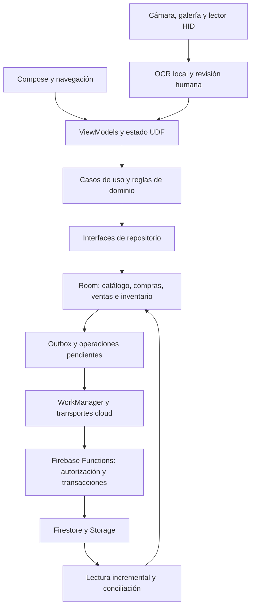

**FacturaStock — análisis profundo del estado actual**

Fecha: 8 de septiembre de 2026. Revisión del árbol de trabajo completo de `/Users/gustavo/Desktop/ProyectoMayda`, sobre el commit `0b2f23d`, incluidos los cambios todavía sin commit.

**Diagnóstico**

FacturaStock tiene una base técnica avanzada: dominio con aritmética exacta, persistencia transaccional, historial de migraciones, recuperación de operaciones pendientes, separación local/cloud y numerosas pruebas. La principal debilidad actual es la coexistencia de rutas de edición con garantías diferentes. El editor nuevo protege versiones, costos y negocios compartidos, pero otros accesos todavía llegan a una escritura antigua que evita esas protecciones.

Se confirmaron seis defectos funcionales o de seguridad mediante reproducciones: cuatro con Room real en Android y dos con Firebase Emulator. Los de mayor prioridad son la reposición involuntaria de stock, la modificación local de existencias compartidas y la recuperación de acceso después de una revocación. Las pruebas unitarias aprobadas no cubren estos escenarios.

La validación completa tampoco está verde: seis pruebas instrumentadas existentes fallan por fixtures o configuración obsoletas y `npm audit` señala una dependencia de desarrollo de severidad alta. La exportación sigue siendo parcial y la restauración integral permanece sin activar. Priorizaría consolidar integridad y recuperación antes de ampliar funcionalidades o distribuir una nueva versión cloud.

**Alcance y evidencia**

Se revisaron arquitectura, rutas de navegación, estado de UI, ventas, inventario, asociación de líneas OCR, Room, migraciones, sincronización, autorización Firebase, reglas, privacidad, restauración, dependencias y CI. Tres revisiones paralelas de backend, datos y UI se contrastaron entre sí para comprobar que los errores encontrados en repositorios tienen accesos reales desde la interfaz.

El árbol inicial contenía 141 archivos versionados modificados y 66 archivos nuevos sin seguimiento. El subconjunto Kotlin de `main`, `local`, `cloud` y `cloudDebug` suma 596 archivos y 133.143 líneas; Functions contiene 11 archivos JavaScript productivos y 8.024 líneas. Son medidas de tamaño, no indicadores de calidad por sí solas. Room v28 contiene 34 entidades. Los módulos Gradle son `app` y `benchmark`; las capas de la aplicación se separan principalmente por paquetes y controles estáticos.

La evidencia se conserva en [el resumen de ejecución](/Users/gustavo/Desktop/ProyectoMayda/build/reports/auditoria/2026-09-08/summary.json), con logs, resultados XML y reproducciones en ese mismo directorio. Solo se añadieron este informe y artefactos de análisis; no se corrigió código productivo ni se desplegaron servicios. Las pruebas Android se ejecutaron en un AVD nuevo y temporal, API 35, con datos sintéticos. No se instaló nada en el dispositivo físico conectado. Los emuladores iniciados para la auditoría se cerraron al terminar.

**Cómo funciona el sistema**

La variante `local` elimina el permiso INTERNET y usa implementaciones locales. La variante `cloud` añade transportes Firebase; las operaciones de stock compartido necesitan respetar la autoridad remota. Existe además una modalidad Spark con escrituras directas y reglas propias, lo que amplía la matriz de contratos que mantener. El diagrama representa la ruta general de Functions, no todos los transportes alternativos.

El flujo de documentos combina captura/importación, OCR local, normalización, revisión y asociación de productos. La confirmación clásica de compras y la nueva incorporación de productos escaneados tienen contratos distintos; la segunda dispone de un recibo durable para impedir aplicar dos veces el mismo borrador. Ventas conserva una intención pendiente antes del envío remoto para poder resolver una respuesta perdida.

**Resultados de ejecución**

| Comprobación | Resultado actual | Interpretación |
| --- | --- | --- |
| `ciStaticAnalysis`, con baseline local `HEAD` | Aprobado | Formato y controles arquitectónicos configurados. No equivale a ejecutar todo GitHub Actions. |
| Unitarias `localDebug` | 1.556 aprobadas; 0 fallos, errores u omisiones | Ejecución nueva del 8 de septiembre. |
| Unitarias `cloudDebug` | 1.734 aprobadas; 0 fallos, errores u omisiones | Incluye muchos casos compartidos con local. |
| Lint local y cloud | 0 errores; 67 advertencias en cada variante | Incluye recursos sin uso, convenciones Compose y avisos de dependencias. |
| Kover del dominio | 87,13 % de líneas; 65,53 % de ramas | Aprobó el mínimo de 80 % de líneas. No mide la cobertura de toda la app. |
| Instrumentación original de datos, API 35 | 509 pruebas: 503 aprobadas y 6 fallidas | Los seis fallos se explican más abajo. |
| Reproducciones adicionales con Room | 4 de 4 confirmaron el defecto buscado | Sus aserciones describen el comportamiento defectuoso actual: aprobarlas significa reproducirlo. |
| Migraciones completas históricas | 27 de 27 aprobadas | Desde cada origen v1–v27 hasta v28. Incluidas en la instrumentación anterior. |
| Suite Firebase | 176 aprobadas, 0 fallidas, 1 omitida | La omisión corresponde a Spark, ejecutado aparte. |
| Suite Spark | 14 de 14 aprobadas | Emuladores con reglas Spark. |
| Reproducciones Firebase | 2 defectos confirmados | Revocación por identidad mutable y límite de historia de inventario. |
| Escáner de secretos | Sin coincidencias de alta confianza | Limitado a los patrones y archivos del escáner. |
| Scripts de contratos de release, artefactos, baseline, benchmarks y ficha Play | Aprobados | Pruebas de los scripts; no se firmó ni publicó una versión. |
| `npm audit` | 8 paquetes señalados: 1 alto y 7 moderados | La dependencia alta está en herramientas de desarrollo; hay una dependencia moderada en runtime. |

La instrumentación ejecutó 513 casos en total: 509 existentes y cuatro reproducciones de auditoría. El resultado global fue 507 aprobados y seis fallos. Los contadores de distintos flavors y suites no representan escenarios todos independientes.

Runtime utilizado: Gradle 8.13, JBR 21.0.11 y Node 24.18.0. Functions declara Node 22, de modo que los resultados del backend no verifican específicamente ese runtime. La compilación local de app y APK de instrumentación se completó. No se ejecutaron pruebas de UI completas, benchmarks físicos, distribución release ni pruebas sobre infraestructura Firebase desplegada.

Logs principales: [calidad Android](/Users/gustavo/Desktop/ProyectoMayda/build/reports/auditoria/2026-09-08/gradle-quality.log), [instrumentación](/Users/gustavo/Desktop/ProyectoMayda/build/reports/auditoria/2026-09-08/gradle-instrumentation.log), [JUnit Android](/Users/gustavo/Desktop/ProyectoMayda/build/reports/auditoria/2026-09-08/instrumentation.xml), [Firebase](/Users/gustavo/Desktop/ProyectoMayda/build/reports/auditoria/2026-09-08/backend-tests.log), [Spark](/Users/gustavo/Desktop/ProyectoMayda/build/reports/auditoria/2026-09-08/spark-tests.log).

**Hallazgos confirmados y orden de atención**

P1 indica una corrección prioritaria antes de distribuir una versión afectada; P2 indica una corrección próxima con alcance o condiciones más acotadas. No se asignan probabilidades que no fueron medidas.

**1. P1 — Guardar el nombre de un producto puede reponer unidades vendidas.**

El editor antiguo de Catálogos precarga la cantidad al abrir el formulario. Al guardar vuelve a imponer esa cantidad aunque solo se haya modificado el nombre. Su repositorio recibe un objetivo absoluto, sin la versión del saldo que vio el usuario.

La reproducción con Room siguió esta secuencia: saldo inicial 5 → formulario conserva 5 → venta de 2 → saldo 3 → guardado con la cantidad antigua → saldo vuelve a 5 y aparece un ajuste +2. La transacción y el CAS internos funcionan; el error está en aplicar una intención antigua como si fuese una edición explícita del stock.

La ruta es alcanzable desde Inventario → Registrar manualmente → cerrar el formulario → seleccionar un producto del listado Catálogos → Editar. Abrir el editor de Inventario por su ruta nueva no demuestra que este acceso alternativo esté protegido.

Evidencia: [precarga de cantidad](/Users/gustavo/Desktop/ProyectoMayda/app/src/main/java/com/facturastock/app/feature/catalogs/CatalogsViewModel.kt:737), [guardado incondicional del stock](/Users/gustavo/Desktop/ProyectoMayda/app/src/main/java/com/facturastock/app/feature/catalogs/CatalogsViewModel.kt:926), [cálculo del ajuste sobre el saldo actual](/Users/gustavo/Desktop/ProyectoMayda/app/src/main/java/com/facturastock/app/data/repository/RoomProductInventoryRepository.kt:74). Prueba: `auditStaleCatalogQuantityRestoresStockSoldWhileFormWasOpen`.

Corrección propuesta: dirigir todas las entradas al editor transaccional, enviar únicamente saldos que el usuario modificó y validar la versión original de esos saldos. Guardar metadatos debe conservar cualquier venta producida mientras el formulario estaba abierto.

**2. P1 — Una ruta de Catálogos permite modificar localmente el stock de un negocio compartido.**

`CatalogsViewModel` conserva una rama que llama a `productInventory.setStock` después de guardar el producto. Esa operación no comprueba el enlace cloud y no publica una operación remota de stock. El editor y registro nuevos sí aplican restricciones para negocios compartidos.

La reproducción creó stock 5, vinculó el negocio y ejecutó el mismo `setStock` utilizado por esa rama. Room terminó con 20 unidades y ninguna operación en outbox. No se envió un ajuste al servidor. La pérdida o sustitución posterior de ese cambio durante la conciliación es una consecuencia del diseño de sincronización, no una prueba ejecutada contra dos teléfonos.

La interfaz permite llegar por el alta manual y por el registro escaneado de un producto ya existente; este último formulario admite una cantidad total y mantiene `isInventoryOrigin=false`.

Evidencia: [entrada desde Inventario](/Users/gustavo/Desktop/ProyectoMayda/app/src/main/java/com/facturastock/app/navigation/FacturaStockApp.kt:758), [cantidad editable](/Users/gustavo/Desktop/ProyectoMayda/app/src/main/java/com/facturastock/app/feature/catalogs/CatalogsRoute.kt:784), [escritura legacy](/Users/gustavo/Desktop/ProyectoMayda/app/src/main/java/com/facturastock/app/feature/catalogs/CatalogsViewModel.kt:930), [transacción sin comprobación cloud](/Users/gustavo/Desktop/ProyectoMayda/app/src/main/java/com/facturastock/app/data/repository/RoomProductInventoryRepository.kt:68). Prueba: `auditSharedBusinessAllowsUnpublishedLocalQuantityMutation`.

Corrección propuesta: imponer la política de stock compartido en la frontera de escritura del repositorio, además de reflejarla en UI. Unificar las rutas de alta y edición para que cambiar el origen de navegación no cambie las garantías de integridad.

**3. P1 — Un administrador expulsado puede recuperar su rol mediante una invitación a su correo nuevo.**

El backend identifica destinatarios ya miembros y cancela invitaciones durante una revocación usando el campo persistido `members.email`. Ese campo puede diferir del correo vigente y verificado de Firebase Auth.

La reproducción en emuladores cambió y verificó el correo de un ADMIN mediante Auth; el ADMIN se invitó a ese correo nuevo; el OWNER lo eliminó y la membresía desapareció; después, el mismo UID aceptó la invitación pendiente y recuperó el rol ADMIN. Requiere un administrador previamente autorizado que prepare esta condición antes de su expulsión. No demuestra acceso arbitrario desde una cuenta ajena sin permisos previos.

Evidencia: [consulta por correo almacenado](/Users/gustavo/Desktop/ProyectoMayda/functions/membership.js:328), [cancelación limitada a ese correo](/Users/gustavo/Desktop/ProyectoMayda/functions/membership.js:737), [recreación de la membresía](/Users/gustavo/Desktop/ProyectoMayda/functions/membership.js:589), [salida de la reproducción](/Users/gustavo/Desktop/ProyectoMayda/build/reports/auditoria/2026-09-08/reproductions.log).

Corrección propuesta: resolver y usar la identidad estable del destinatario cuando exista, y conservar una invalidación durable que impida aceptar invitaciones anteriores a una revocación. Revalidar esa condición dentro de la transacción de aceptación; actualizar únicamente la copia de correo no cubre por sí solo las carreras.

**4. P2 — Una cantidad inicial sin costo se convierte en ganancia aparentemente cierta del 100 %.**

El formulario antiguo admite cantidad inicial sin costo de compra. `setStock` genera un ajuste con `unitCost=null`, pero crea el saldo con promedio cero. Al vender, ese promedio se congela como costo histórico válido y el reporte deja de distinguir costo desconocido de costo cero confirmado.

La reproducción registró 5 unidades sin costo y vendió 2 a S/5. El resultado fue costo histórico S/0, ganancia S/10 y ninguna incidencia. Es un problema de información contable incluso cuando las cantidades y el importe cobrado son correctos.

Evidencia: [ajuste sin costo](/Users/gustavo/Desktop/ProyectoMayda/app/src/main/java/com/facturastock/app/data/repository/RoomProductInventoryRepository.kt:83), [inicialización del promedio](/Users/gustavo/Desktop/ProyectoMayda/app/src/main/java/com/facturastock/app/data/repository/RoomProductInventoryRepository.kt:194), [congelación al vender](/Users/gustavo/Desktop/ProyectoMayda/app/src/main/java/com/facturastock/app/data/repository/RoomSaleRepository.kt:845). Prueba: `auditUnknownInitialCostBecomesCertainZeroCostAndFullProfit`.

Corrección propuesta: exigir costo explícito en las altas con existencias o conservar su estado desconocido hasta ventas y reportes. La ausencia de costo debe producir una indicación de ganancia no calculable, no un cero implícito. Conviene evaluar también los registros históricos creados por esta ruta.

**5. P2 — El movimiento 101 puede bloquear el ingreso del producto en un almacén nuevo.**

Antes de crear un saldo ausente, el backend consulta hasta 101 movimientos del producto y rechaza si hay más de 100. El límite se comprueba antes de distinguir historia antigua y movimientos modernos de otros almacenes.

El helper real, ejecutado sobre Firestore Emulator, permitió crear el saldo con 100 movimientos modernos y devolvió `INVENTORY_HISTORY_SCAN_LIMIT` con 101. En negocios nacidos con compras v4 se crea metadata sin `bootstrapComplete`; el bootstrap tampoco resuelve ese caso, porque rechaza una metadata ya existente. El bloqueo no desaparece al reintentar.

Evidencia: [límite previo al análisis de almacenes](/Users/gustavo/Desktop/ProyectoMayda/functions/inventorySync.js:478), [metadata de compras v4](/Users/gustavo/Desktop/ProyectoMayda/functions/index.js:1382), [bootstrap rechaza inventario ya inicializado](/Users/gustavo/Desktop/ProyectoMayda/functions/inventoryBootstrap.js:391).

Corrección propuesta: representar explícitamente qué historia necesita migración y separar esa condición del número de movimientos modernos. Mantener consultas acotadas sin convertir su límite en una prohibición permanente de abrir otro almacén. La reproducción ejecutó el helper transaccional; la propagación al flujo completo de compra se verificó en código.

**6. P2 — Vincular cloud durante una venta local puede dejarla publicada solo en el dispositivo.**

El checkout decide según el enlace observado antes de llamar al transporte. Si este devuelve `NotRequired`, la transacción final no vuelve a exigir que el negocio siga sin enlace. A su vez, crear el enlace no bloquea una intención de checkout local pendiente.

La reproducción intercaló determinísticamente `bindOnce` entre la decisión local del transporte y su respuesta. El checkout terminó publicado, descontó stock local y eliminó la intención pendiente, con el negocio ya vinculado. El transporte de prueba controló el momento de la intercalación; Room, las transacciones y el repositorio de enlace fueron reales. No se ejecutó una carrera espontánea entre teléfonos.

Evidencia: [decisión y envío del checkout](/Users/gustavo/Desktop/ProyectoMayda/app/src/main/java/com/facturastock/app/data/repository/RoomSaleRepository.kt:489), [creación del binding](/Users/gustavo/Desktop/ProyectoMayda/app/src/main/java/com/facturastock/app/data/repository/RoomCloudBusinessBindingRepository.kt:75). Prueba: `auditBindingDuringLocalAuthorizationStillPostsWithoutRemoteCommit`.

Corrección propuesta: validar dentro del commit la misma condición local/cloud usada al preparar la intención; coordinar el enlace y los checkouts pendientes. Probar ambos órdenes de finalización, cancelación y recreación del proceso.

Las cuatro reproducciones Android están en [AuditDataConsistencyReproductionTest.kt](/Users/gustavo/Desktop/ProyectoMayda/build/reports/auditoria/2026-09-08/AuditDataConsistencyReproductionTest.kt). El [reproductor backend](/Users/gustavo/Desktop/ProyectoMayda/build/reports/auditoria/2026-09-08/reproduce-backend-findings.mjs) utiliza datos sintéticos y emuladores. Son evidencia de auditoría, todavía no regresiones integradas en CI.

**Los seis fallos de instrumentación existentes**

| Grupo | Causa comprobada | Qué no llegó a verificarse |
| --- | --- | --- |
| Dos casos `soleInvoiceScanRetake…` de `InvoiceDraftRepositoryTest` | La fixture asigna un proveedor inexistente; la FK falla durante la preparación. | Las aserciones de reemplazo y conservación de la fotografía. |
| Dos casos de `RoomCloudBusinessBindingMigrationIntegrationTest` | El builder del test registra migraciones hasta v25 e intenta abrir v28. | El enlace y procesamiento de la operación legacy. |
| Dos casos de `FullDeviceSnapshotSQLitePreflightTest` | Crean una base v28, pero declaran y esperan el hash de v27. | El camino exitoso del preflight actual y su rechazo específico de FK. |

Referencias: [proveedor no creado](/Users/gustavo/Desktop/ProyectoMayda/app/src/androidTest/java/com/facturastock/app/data/repository/InvoiceDraftRepositoryTest.kt:1198), [lista antigua de migraciones en el test](/Users/gustavo/Desktop/ProyectoMayda/app/src/androidTest/java/com/facturastock/app/data/repository/RoomCloudBusinessBindingMigrationIntegrationTest.kt:182), [hash desactualizado](/Users/gustavo/Desktop/ProyectoMayda/app/src/androidTest/java/com/facturastock/app/data/restore/FullDeviceSnapshotSQLitePreflightTest.kt:170).

El builder productivo sí registra las migraciones recientes y las 27 rutas completas aprobaron. El preflight rechaza correctamente la identidad incompatible. Por tanto, estos resultados no demuestran seis errores de migración o persistencia de la app, pero sí bloquean la suite y dejan esos escenarios específicos sin validación. Hay que reparar las fixtures, actualizar también expectativas antiguas de versión y repetir los casos afectados.

**Dependencias y seguridad de entrega**

El lockfile contiene `fast-uri@3.1.5`, marcado como dependencia de desarrollo a través de `firebase-tools` y AJV. `npm audit` lo clasifica alto por avisos de normalización de URI. El aviso oficial consultado sitúa la corrección de esa rama en 3.1.6. Esto bloquea el umbral `--audit-level=high` configurado en CI, aunque no demuestra una explotación en el backend productivo de FacturaStock. [Aviso del mantenedor de fast-uri](https://github.com/fastify/fast-uri/security/advisories/GHSA-f65p-4m7j-42xc).

También aparece `qs@6.15.3` en el árbol de runtime a través de `firebase-functions` → Express/body-parser. El aviso consultado documenta una denegación de servicio bajo condiciones concretas de parseo y serialización y señala 6.16.0 como versión corregida. No se reprodujo una explotación de las Functions del proyecto. [Aviso de qs](https://github.com/ljharb/qs/security/advisories/GHSA-4mjr-xmp4-gh2g).

Los otros paquetes moderados señalados son `@google-cloud/pubsub`, `@opentelemetry/core`, `body-parser`, `express`, `firebase-tools` y `stream-json`; varios son propagaciones del mismo aviso en el árbol. Ocho paquetes señalados no equivalen a ocho vulnerabilidades independientes. Evidencia: [npm-audit.json](/Users/gustavo/Desktop/ProyectoMayda/build/reports/auditoria/2026-09-08/npm-audit.json).

Recomiendo actualizar de forma dirigida el lockfile y volver a ejecutar las suites con Node 22. La sugerencia automática de npm para parte del árbol incluye bajar `firebase-tools` a 10.1.1; esa propuesta no fue evaluada como compatible y no debe interpretarse como una solución validada para este proyecto.

**Observaciones de UI pendientes de reproducción visual**

El total visible de Ventas usa `fold(Money.zero(...), Money::plus)` fuera de un bloque que traduzca el desbordamiento a estado de formulario. Una entrada individual válida de `92233720368547758.07` PEN, sumada a otra línea de 1 PEN, desborda el total. El código apunta a una excepción no manejada durante la edición; es un caso extremo, identificado estáticamente, sin reproducción del cierre de la app. [SalesViewModel.kt](/Users/gustavo/Desktop/ProyectoMayda/app/src/main/java/com/facturastock/app/feature/sales/SalesViewModel.kt:1462).

El diálogo «Crear producto» de matching coloca cuatro campos y los botones en una columna sin desplazamiento. Una ventana baja, teclado o texto grande puede dejar controles inferiores fuera del área utilizable. Debe verificarse con alturas reducidas y escalado de fuente; esta auditoría confirma la falta de scroll, no una combinación concreta medida en pantalla. [InvoiceMatchingScreen.kt](/Users/gustavo/Desktop/ProyectoMayda/app/src/main/java/com/facturastock/app/feature/matching/InvoiceMatchingScreen.kt:685).

**Fortalezas que conviene conservar**

- Room v28 añade dos tablas a las 32 anteriores, sin cambiar esas estructuras históricas. Hay transacciones, restricciones de integridad, historial inmutable y control de versiones. El problema de stock descrito arriba demuestra que estas defensas necesitan recibir una intención correcta desde todas las rutas.
- El dominio usa `Money` y `BigDecimal`, con decisiones explícitas de escala y redondeo. La nueva asociación de facturas valida unidades, monedas, versiones y cantidades antes del commit, y guarda un recibo durable de aplicación.
- Las ventas pendientes conservan contenido e identidad para resolver respuestas inciertas. Outbox utiliza claims, leases y destino cloud durable; el worker revalida sesión y negocio durante la ejecución.
- Firebase incluye autorización por negocio dentro de transacciones, App Check fuera del emulador, idempotencia, cuotas y recuperación de borrados y subidas interrumpidas. Esas defensas tienen pruebas específicas; el fallo de invitaciones corresponde a una identidad mutable que sus casos actuales no cubren.
- La UI aplica UDF, `StateFlow`, recogida de efectos según lifecycle y restauración selectiva. Matching conserva decisiones en un payload acotado y las revalida; captura contempla commits que sobreviven a la recreación.
- Las imágenes retenidas cuentan con cifrado AES-GCM y clave no exportable del Keystore; hay reglas de retención, publicación durable y restricciones de exposición. La variante local elimina red y el OCR se ejecuta en el dispositivo.
- CI contempla análisis, seguridad, migraciones, UI, integración Firebase, Spark, matriz SDK, rendimiento y empaquetado. Acciones fijadas por hash, artefactos sanitizados y contratos de release aportan una base útil de entrega.

**Recuperación, rendimiento y mantenibilidad**

La restauración integral es una capacidad pendiente. `FullDeviceSnapshotRestoreCoordinator` devuelve `NOT_READY` incluso con archivo y recibo válidos, porque falta detener coordinadamente los productores de escrituras y activar la base restaurada. Existen validadores, journal y primitivas de reemplazo; su presencia no ofrece todavía una restauración utilizable. [Bloqueo explícito de activación](/Users/gustavo/Desktop/ProyectoMayda/app/src/main/java/com/facturastock/app/data/restore/FullDeviceSnapshotRestoreReadiness.kt:224).

La exportación contable excluye expresamente ventas, deudas, pagos, imágenes, borradores, preferencias y estado de sincronización. Está descrito en el contrato y en UI. Para una aplicación que conserva información comercial, completar exportación y restauración verificable merece prioridad de producto, especialmente para cambiar de dispositivo o recuperar una instalación local. [Contrato de exportación](/Users/gustavo/Desktop/ProyectoMayda/app/src/main/java/com/facturastock/app/domain/model/PrivacyModels.kt:385).

Hay optimizaciones razonadas: consultas paginadas en algunos históricos, supresión de emisiones idénticas, trabajo de cálculo fuera de Main y baseline profiles. No se midieron tiempos ni memoria en un dispositivo físico durante esta auditoría; no se deducen porcentajes de mejora. El detalle de inventario todavía materializa todos los movimientos del producto, una consulta a medir con historia representativa antes de prometer escalabilidad. [Lectura del detalle](/Users/gustavo/Desktop/ProyectoMayda/app/src/main/java/com/facturastock/app/data/repository/RoomInventoryReadRepository.kt:94).

La complejidad está concentrada: `SalesViewModel` tiene 1.696 líneas, navegación 1.592, `FacturaStockDatabase` 1.678, `app/build.gradle.kts` 2.377 y el workflow 1.034. Extraer responsabilidades concretas puede hacer más fácil verificar invariantes; la primera extracción útil sería unificar las operaciones de producto/stock. Una modularización posterior puede reforzar las fronteras que hoy comprueban expresiones regulares, sin mezclar esa tarea con correcciones contables.

La documentación también necesita ponerse al día: README presenta el esquema vigente como v27, mientras el código y exportación actual usan v28. El esquema 28 y otros cambios importantes aún no están en Git. Conviene guardar cambios en commits coherentes y comprobar explícitamente los archivos nuevos antes del siguiente avance: el control de CI de esquemas exige un árbol limpio tras su generación.

**Plan recomendado con criterios de cierre**

| Orden | Trabajo | Evidencia necesaria para darlo por cerrado |
| --- | --- | --- |
| 1 | Unificar todas las altas/ediciones de producto e inventario | Guardar nombre conserva ventas concurrentes; todas las entradas rechazan o publican correctamente el stock compartido. |
| 2 | Corregir revocación e invitaciones | Cambio de correo + expulsión + invitación antigua no permite recuperar membresía ni rol. |
| 3 | Conservar costo desconocido y coordinar binding/checkout | Reporte sin costo informa incertidumbre; ambos órdenes de carrera local/cloud mantienen autoridad y operación recuperable. |
| 4 | Resolver límite de historia y reparar fixtures | Casos 100/101 y almacén nuevo aprobados; los seis tests originales alcanzan sus aserciones y pasan. |
| 5 | Actualizar dependencias y guardar un estado reproducible | Auditoría de dependencias compatible con el umbral de CI; suites backend en Node 22; esquema y fuentes nuevos incluidos en Git. |
| 6 | Completar recuperación y verificar UI/rendimiento | Exportar/importar en un dispositivo limpio conserva datos y archivos; pruebas de ventanas reducidas, lector físico y métricas representativas. |

El trabajo inmediato con más impacto es cerrar las rutas alternativas de escritura y las condiciones de autorización. Las nuevas regresiones deben cruzar navegación, versión de datos y resultado persistido: probar cada componente por separado ya dejó pasar los defectos reproducidos aquí.
