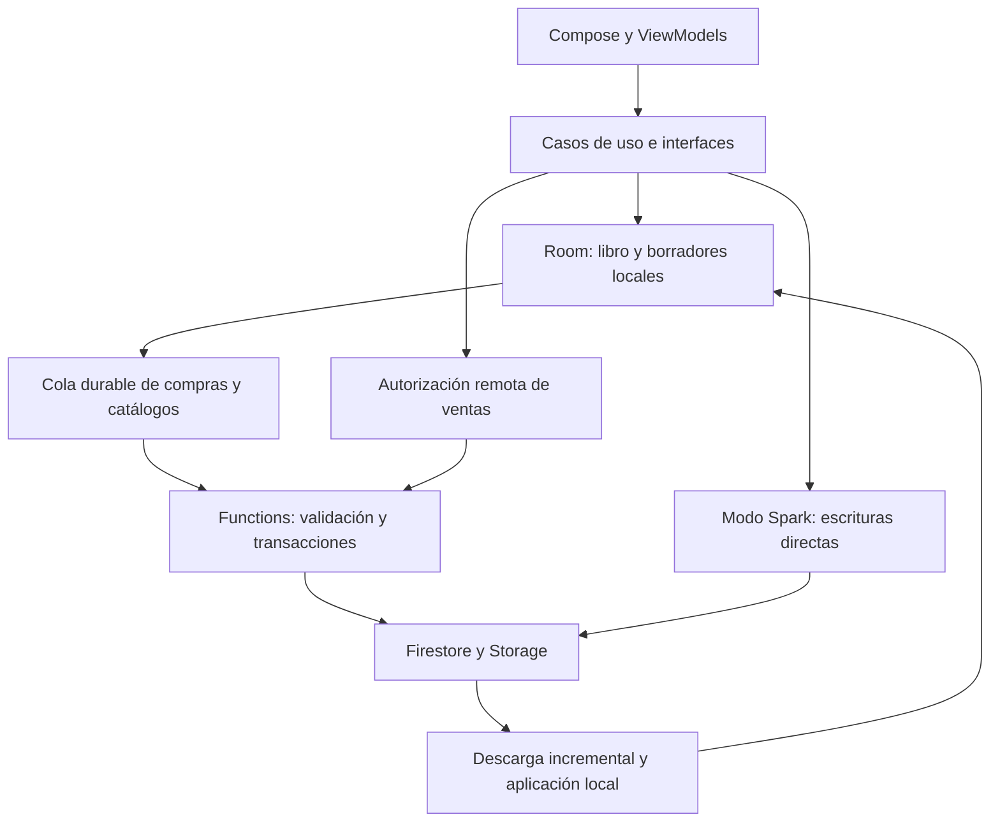

**FacturaStock — revisión técnica del 23 de septiembre de 2026.**

El proyecto tiene una base técnica considerable: operaciones contables con aritmética exacta, almacenamiento transaccional, controles de concurrencia y muchas pruebas. Sin embargo, el código actual conserva defectos importantes de autorización, sincronización y continuidad operativa. Mi recomendación es estabilizar estos contratos y completar la recuperación de datos antes de ampliar funcionalidades o depender de la operación compartida entre teléfonos.

Esta revisión analiza el commit `e1d03a2` y el árbol de trabajo actual, que inicialmente contenía 35 archivos modificados y 17 sin seguimiento. Incluye los cambios recientes de ventas, escáner, registro manual e inventario. No se modificaron fuentes funcionales, dependencias, reglas ni datos del negocio. Se añadió este informe y evidencia bajo `build/reports/`. Los informes anteriores sirvieron como pistas: los hallazgos aquí descritos se contrastaron con código actual y, cuando se indica, con nuevas ejecuciones. La revisión estuvo enfocada por riesgo; no equivale a verificar exhaustivamente cada línea ni todos los dispositivos.

**Producto y arquitectura observados.**

FacturaStock es una aplicación Android nativa en español para ventas, inventario, compras, lectura de códigos, OCR de documentos, cuentas por cobrar y reportes. Declara versión 1.0.12, código 13, Android mínimo API 26 y compilación/objetivo API 36. Sus dos módulos Gradle son `app` y `benchmark`. La separación entre presentación, dominio y datos vive principalmente en paquetes dentro de `app`, con interfaces e inyección Hilt.

Kotlin, Compose y Material 3 forman la interfaz; Room conserva el libro local; CameraX y ML Kit permiten captura/OCR; WorkManager procesa trabajo diferido. La variante `local` elimina INTERNET. La variante `cloud` incorpora Firebase y exige autorización remota para cerrar ventas de negocios enlazados; las compras se publican localmente y luego se envían mediante una cola durable. Esa diferencia entre compras diferidas y ventas autorizadas online explica varios riesgos de reconciliación.

Spark es un modo adicional con reglas y adaptadores propios; su build type es depurable y usa firma debug. Las garantías de Functions no se trasladan automáticamente a él. La navegación principal contiene Ventas, Inventario y Reportes; compras/OCR y catálogo general conservan rutas secundarias.

El esquema real es Room v29, con 35 entidades y 29 esquemas exportados. README todavía indica v27. El inventario de código de `app/src` es de 621 archivos Kotlin de producción/soporte de variantes (141.485 líneas), 241 archivos JVM de pruebas (73.751 líneas) y 131 archivos instrumentados (53.871 líneas). Functions contiene 11 archivos JavaScript productivos. Estos números incluyen comentarios y blancos; no son una medida de calidad.

**Fortalezas verificadas en el código.**

- Dinero en unidades menores con comprobación de desbordamiento; cantidades y costos con decimales exactos y reglas de redondeo explícitas.
- Transacciones Room, control de versiones, restricciones y triggers; movimientos publicados inmutables y anulaciones mediante compensación.
- Migraciones explícitas, esquemas históricos y prohibición de migración destructiva.
- Intención durable de checkout, claves idempotentes, outbox con reintentos y aislamiento por negocio.
- Edición habitual desde Inventario basada en snapshots; registro directo con identidad reservada para evitar duplicados tras recreación.
- Escáner con cola acotada, control de sesiones y respuestas tardías; recuperación de códigos que considera competidores archivados o sin stock.
- Caché incremental de inventario por colector, publicación completa de snapshots y cancelación cooperativa. No encontré un defecto concreto en esa materialización nueva.
- OCR local, archivos privados, cifrado de imágenes retenidas mediante Android Keystore y envío de diagnóstico condicionado al consentimiento.
- Functions comprueba identidad, correo verificado, roles y App Check fuera del emulador; las reglas principales deniegan escrituras cliente directas. La eliminación de cuenta tiene trabajo durable y reanudación.
- CI con análisis estático, pruebas, cobertura de dominio, emuladores, migraciones, rendimiento y validaciones de artefactos.

**Hallazgos de prioridad alta.** P1 significa riesgo importante de autorización, integridad o continuidad. Se distingue ejecución de componentes, reproducción backend y análisis de código; ninguno debe interpretarse como una prueba completa de todos los recorridos Android.

**1. P1 — Un fallo en la comprobación biométrica abre la sesión y desactiva el bloqueo.**

`requestUnlock` llama a recuperación ante cualquier resultado distinto de éxito. La recuperación cambia inmediatamente a `UNLOCKED` y persiste `biometricLockEnabled=false`, sin autenticación exitosa. También cubre errores transitorios o estado desconocido. [Rama de comprobación](/Users/gustavo/Desktop/ProyectoMayda/app/src/main/java/com/facturastock/app/MainActivity.kt:337), [desbloqueo](/Users/gustavo/Desktop/ProyectoMayda/app/src/main/java/com/facturastock/app/MainActivity.kt:380).

Además, la combinación utilizada, `BIOMETRIC_STRONG | DEVICE_CREDENTIAL`, no está soportada en API 28–29 según la [documentación oficial AndroidX](https://developer.android.com/reference/androidx/biometric/BiometricManager). Esas API están dentro del rango de la aplicación. Esto afecta al bloqueo adicional de la app; no implica saltarse el bloqueo del sistema operativo. Verificado por código y documentación, sin prueba biométrica física nueva.

Corrección: mantener la sesión bloqueada frente a errores, utilizar una ruta de credencial compatible con cada API y proporcionar recuperación autenticada. La regresión debe cubrir hardware temporalmente indisponible, estado desconocido y API 28/29.

**2. P1 — Un administrador expulsado puede recuperar acceso mediante una invitación pendiente.**

Se reprodujo de nuevo contra emuladores: un ADMIN cambia/verifica su correo, se invita al nuevo correo, el OWNER lo elimina y después el mismo UID acepta la invitación. La membresía desaparece y vuelve a existir como ADMIN. La detección de miembros y cancelación de invitaciones usan el correo histórico de la membresía; la aceptación no invalida la invitación por la revocación de esa identidad.

[Consulta por correo](/Users/gustavo/Desktop/ProyectoMayda/functions/membership.js:328), [aceptación](/Users/gustavo/Desktop/ProyectoMayda/functions/membership.js:576), [revocación](/Users/gustavo/Desktop/ProyectoMayda/functions/membership.js:737), [evidencia HTTP actual](/Users/gustavo/Desktop/ProyectoMayda/build/reports/auditoria-2026-09-23/backend/email-revocation.jsonl). El cambio/verificación del correo se simuló mediante Admin Auth; las operaciones de negocio se ejecutaron con callables autenticadas.

Corrección: vincular revocación y vigencia de invitaciones a identidades estables y generaciones de autorización. Cubrir cambio de correo, auto-invitación y aceptación después de expulsión.

**3. P1 — Publicar y anular una compra puede dejar bloqueada la descarga de otro teléfono.**

El servidor guarda el cambio por `purchaseId` y lo sobrescribe al anular. Android exige secuencias consecutivas. Reproducción nueva: publicación seq1, anulación seq2 y pull desde cursor0 producen únicamente seq2; el cliente espera seq1 y rechaza la página. Reintentar no recrea el evento perdido. Un teléfono que ya recibió seq1 evita este caso concreto.

[Identidad del cambio](/Users/gustavo/Desktop/ProyectoMayda/functions/index.js:1083), [sobrescritura](/Users/gustavo/Desktop/ProyectoMayda/functions/index.js:1559), [contrato cliente](/Users/gustavo/Desktop/ProyectoMayda/app/src/main/java/com/facturastock/app/domain/usecase/SyncUseCases.kt:307), [respuesta backend actual](/Users/gustavo/Desktop/ProyectoMayda/build/reports/auditoria-2026-09-23/backend/reproduce-contracts.jsonl).

Corrección: adoptar eventos inmutables o definir una réplica del último estado y alinear feed, cursor y caché. Eliminar solo la primera validación no basta: la reconciliación también exige cobertura exacta desde la secuencia 1.

**4. P1 — Un saldo remoto puede ocultar una compra local todavía pendiente.**

Ejemplo: saldo compartido 10; compra local +5 pendiente deja 15; otro teléfono vende 2 y genera saldo remoto 8. El aplicador sustituye 15 por 8, aunque el movimiento local +5 siga publicado. Una proyección que combine ambos efectos sería 13; alternativamente debe distinguir cantidades confirmadas y pendientes. El envío posterior puede corregirlo, pero un conflicto permanente no garantiza recuperación.

El worker descarga incluso cuando la pasada tiene reintentos o conflictos; tampoco se impide una compra nueva entre envío y descarga. [Worker](/Users/gustavo/Desktop/ProyectoMayda/app/src/main/java/com/facturastock/app/data/sync/PurchaseBackupSyncWorker.kt:396), [sustitución del saldo](/Users/gustavo/Desktop/ProyectoMayda/app/src/main/java/com/facturastock/app/data/repository/RoomSharedInventoryApplicationRepository.kt:340). Se volvió a ejecutar SQL productivo en SQLite aislado: confirmó el reemplazo 15→8. [Evidencia](/Users/gustavo/Desktop/ProyectoMayda/build/reports/audit-2026-09-23/persistence-probe.txt).

Corrección: separar saldo remoto y efectos locales pendientes, o establecer una barrera coherente por producto/almacén. Hace falta una regresión integrada con dos dispositivos y envío fallido.

**5. P1 — Rechazos definitivos pueden congelar un carrito compartido sin salida de corrección.**

Android guarda la intención de cierre antes de enviar la venta. `Rejected` conserva esa intención, mientras editar o quitar líneas queda prohibido. Ejemplo reproducido por componentes: Room admite 101 líneas; el canonicalizador productivo de Functions devuelve `SALE_LINES_LIMIT`; el bloqueo durable impide quitar la línea sobrante. También ocurre ante un producto remoto archivado que devuelve `SALE_PRODUCT_UNAVAILABLE` antes de escribir.

[Condiciones de liberación](/Users/gustavo/Desktop/ProyectoMayda/app/src/main/java/com/facturastock/app/data/repository/RoomSaleRepository.kt:502), [mapper remoto](/Users/gustavo/Desktop/ProyectoMayda/app/src/cloud/java/com/facturastock/app/data/sync/FirebaseRemoteSaleSyncRepository.kt:510), [límite ejecutado](/Users/gustavo/Desktop/ProyectoMayda/build/reports/audit-2026-09-23/sale-limit-probe.txt), [guarda SQL ejecutada](/Users/gustavo/Desktop/ProyectoMayda/build/reports/audit-2026-09-23/persistence-probe.txt).

Corrección: validar límites antes de congelar y distinguir rechazo definitivo sin escritura de una respuesta ambigua. Solo los resultados ambiguos deben conservar la intención hasta resolver su estado; liberar todos los fallos indiscriminadamente introduciría riesgo de duplicación.

**6. P1 nuevo — Una compra nueva puede impedir migrar el inventario antiguo.**

En un negocio con compras legacy sin saldos compartidos, una compra v4 de otro producto pasa la validación y crea `inventoryMetadata`. La migración posterior rechaza cualquier metadata existente. La validación previa a la compra solo busca historia de sus propios productos, por lo que permite inicializar parcialmente el negocio.

Reproducción nueva mediante HTTP: el control con inventario legacy de 10 unidades migra con éxito; al publicar primero una compra de otro producto, esa compra pasa, la migración devuelve `INVENTORY_ALREADY_INITIALIZED` y el saldo remoto del producto antiguo sigue ausente. [Validación por producto](/Users/gustavo/Desktop/ProyectoMayda/functions/inventorySync.js:472), [creación del metadata](/Users/gustavo/Desktop/ProyectoMayda/functions/index.js:1382), [rechazo de migración](/Users/gustavo/Desktop/ProyectoMayda/functions/inventoryBootstrap.js:392).

El enlace Android solo fija el negocio. El worker prepara documentos/catálogos; el transporte de compras envía directamente. La migración de inventario se intenta después de un rechazo de venta, cuando ya puede ser tarde. [Invocación Android](/Users/gustavo/Desktop/ProyectoMayda/app/src/cloud/java/com/facturastock/app/data/sync/FirebaseRemoteSaleSyncRepository.kt:343), [evidencia](/Users/gustavo/Desktop/ProyectoMayda/build/reports/auditoria-2026-09-23/backend/legacy-migration.jsonl), [reproducción reutilizable](/Users/gustavo/Desktop/ProyectoMayda/build/reports/auditoria-2026-09-23/backend/reproduce-legacy-migration.mjs).

Corrección: convertir la migración en precondición transaccional de la primera mutación del inventario del negocio, o admitir una migración progresiva coherente. Preparar también reparación para negocios ya parcialmente inicializados.

**Otros defectos funcionales y de experiencia.**

| Prioridad | Problema y escenario | Evidencia actual y acción |
| --- | --- | --- |
| P2 | Functions acepta `2026-99-99` y moneda `ZZZ`; Android no puede interpretar la página que los contiene. Requiere un cliente modificado o una regresión del emisor. | Aceptación HTTP reejecutada; rechazo cliente trazado. [Validación backend](/Users/gustavo/Desktop/ProyectoMayda/functions/index.js:464), [mapper](/Users/gustavo/Desktop/ProyectoMayda/app/src/cloud/java/com/facturastock/app/data/sync/SyncPullMappers.kt:77). Compartir contrato semántico y reparar datos incompatibles. |
| P2 | Spark omite `syncedBy` en toda compra del feed; el mapper exige la clave con valor null, por lo que rechaza páginas no vacías. | Verificación estática. [Adaptador](/Users/gustavo/Desktop/ProyectoMayda/app/src/cloud/java/com/facturastock/app/data/sync/FirebaseRemoteLedgerRepository.kt:222), [claves exigidas](/Users/gustavo/Desktop/ProyectoMayda/app/src/cloud/java/com/facturastock/app/data/sync/SyncPullMappers.kt:316). Añadir null y probar el adaptador real contra el parser. |
| P2 | Venta con costo USD y cobro PEN permitida al publicar, rechazada como historia inválida al anular. | Trazado y SQL productivo reejecutado. [Validación](/Users/gustavo/Desktop/ProyectoMayda/app/src/main/java/com/facturastock/app/data/repository/RoomSaleVoidRepository.kt:173). Separar moneda del costo histórico y moneda del cobro/reembolso, incluyendo triggers. |
| P2 | El editor general de Catálogos precarga stock y lo vuelve a fijar al guardar metadatos. Abrir con 10, vender 2 y guardar solo el nombre puede devolverlo a 10. | Trazado. [Guardado](/Users/gustavo/Desktop/ProyectoMayda/app/src/main/java/com/facturastock/app/feature/catalogs/CatalogsViewModel.kt:1219). La ruta sigue accesible después del matching de factura. El editor habitual de Inventario sí utiliza snapshots. Unificar ambos. |
| P2 nuevo | Escanear el SKU de un producto por peso sin barcode agrega `min(1, stock)` kg sin abrir el editor de peso/importe. Ejemplo: arroz a S/8/kg, 10 kg, SKU ARROZ-001 → 1 kg/S/8 automáticamente; con 0,3 kg disponibles agrega ese saldo. | Trazado de la ruta completa, sin ejecución UI nueva. [Escaneo](/Users/gustavo/Desktop/ProyectoMayda/app/src/main/java/com/facturastock/app/feature/sales/SalesViewModel.kt:1281), [cantidad](/Users/gustavo/Desktop/ProyectoMayda/app/src/main/java/com/facturastock/app/feature/sales/SalesViewModel.kt:1872), [selección por nombre](/Users/gustavo/Desktop/ProyectoMayda/app/src/main/java/com/facturastock/app/feature/sales/SalesViewModel.kt:1456). Reutilizar el editor de peso en ambos caminos. |
| P2 nuevo | Una lectura ambigua puede ejecutar una consulta individual por cada candidato agotado. El límite de cinco se aplica a productos vendibles, no a candidatos examinados. | Estructura confirmada; latencia sin medir. [Bucle](/Users/gustavo/Desktop/ProyectoMayda/app/src/main/java/com/facturastock/app/feature/sales/SalesViewModel.kt:1323), [consulta](/Users/gustavo/Desktop/ProyectoMayda/app/src/main/java/com/facturastock/app/feature/sales/SalesViewModel.kt:1405). Mil códigos 12345000…12345999 agotados y lectura 12345 recorren mil consultas secuenciales. Resolver disponibilidad por lote o conservar resultados negativos con versión. |
| P2 UX | Registro manual rechaza unidad o almacén archivado con un mensaje genérico sobre campos inválidos; esas dependencias están ocultas y no se pueden corregir desde el formulario. | Código y pruebas existentes verifican rechazo, pero no recuperación útil. [Validación](/Users/gustavo/Desktop/ProyectoMayda/app/src/main/java/com/facturastock/app/feature/catalogs/CatalogsViewModel.kt:852), [formulario](/Users/gustavo/Desktop/ProyectoMayda/app/src/main/java/com/facturastock/app/feature/catalogs/CatalogsRoute.kt:265). Mostrar causa y acción sin perder los datos ingresados. |
| P2 | Reportes puede quedarse en el día anterior si la primera respuesta llega después de medianoche sin otro evento de reanudación. | Trazado: [temporizador](/Users/gustavo/Desktop/ProyectoMayda/app/src/main/java/com/facturastock/app/feature/reports/ReportsViewModel.kt:515). Reabrir rangos caducados con protección contra bucles. |
| P2 accesibilidad | El campo del escáner consume Tab y Shift+Tab incluso vacío, impidiendo navegación normal por teclado. | Trazado: [dispatchKeyEvent](/Users/gustavo/Desktop/ProyectoMayda/app/src/main/java/com/facturastock/app/feature/common/ScannerCodeInput.kt:349). Distinguir terminador de lectura y navegación; pendiente prueba física. |
| P3 | El nombre del deudor se pierde si el proceso se recrea antes de persistir la intención de cierre, aunque los artículos se recuperan. | [Actualización en memoria](/Users/gustavo/Desktop/ProyectoMayda/app/src/main/java/com/facturastock/app/feature/sales/SalesViewModel.kt:301). Persistir el campo de borrador; los términos de una intención de cierre ya guardada sí se recuperan. |

**Recuperación de datos: limitación operativa prioritaria.**

La restauración integral aún no está terminada. El coordinador devuelve `NOT_READY` incluso con snapshot y recibo válidos, porque falta detener escritores, cerrar Room y activar la base restaurada de forma coordinada. [Compuerta productiva](/Users/gustavo/Desktop/ProyectoMayda/app/src/main/java/com/facturastock/app/data/restore/FullDeviceSnapshotRestoreReadiness.kt:194).

El backup automático Android y la transferencia están excluidos. La exportación `ACCOUNTING_LEDGER` v4 omite cabeceras/líneas de venta, deudas, pagos, imágenes y otros datos; el contrato declara estas exclusiones. [Exportación](/Users/gustavo/Desktop/ProyectoMayda/app/src/main/java/com/facturastock/app/domain/model/PrivacyModels.kt:413), [reglas Android](/Users/gustavo/Desktop/ProyectoMayda/app/src/main/res/xml/data_extraction_rules.xml:1). La nube reconstruye lo que recibió, pero no representa una restauración integral del dispositivo. Es una capacidad incompleta reconocida por el código, no una restauración silenciosamente exitosa.

El criterio de aceptación pendiente es recuperar en una instalación vacía productos, compras, ventas, deudas, pagos, imágenes y ajustes necesarios, y comparar saldos, relaciones e invariantes antes y después.

**Dependencias y entrega.**

La consulta nueva de `npm audit` informa 13 paquetes afectados: 3 altos y 10 moderados. Excluyendo desarrollo permanecen `sharp` (alta) y `qs` (moderada). Son paquetes afectados, no 13 vulnerabilidades explotables independientes de esta aplicación. El gate CI utiliza `--audit-level=high`, por lo que queda bloqueado. [Auditoría completa](/Users/gustavo/Desktop/ProyectoMayda/build/reports/audit-2026-09-23/npm-audit.json), [producción](/Users/gustavo/Desktop/ProyectoMayda/build/reports/audit-2026-09-23/npm-production-audit.json).

`sharp` está fijado a 0.35.3; el [aviso del mantenedor](https://github.com/lovell/sharp/security/advisories/GHSA-rgj7-g3m4-5g8c) identifica correcciones desde 0.35.4. La ruta productiva exige firma JPEG antes de decodificar y comprueba formato, tamaño y dimensiones; eso limita la exposición y no se demostró explotación. Actualizar de forma controlada, comprobar el árbol resuelto y repetir las pruebas de documentos. No aplicar indiscriminadamente cambios mayores sugeridos por `audit fix`.

La política de historial Room también falla: el commit actual agrega v28 y v29 respecto al padre, pero el script solo admite una versión nueva por comparación. Los eventos programados/manuales usan ese padre como baseline. [Restricción](/Users/gustavo/Desktop/ProyectoMayda/scripts/verify-room-schema-history.sh:56), [baseline](/Users/gustavo/Desktop/ProyectoMayda/scripts/resolve-spotless-base.sh:29), [ejecución actual](/Users/gustavo/Desktop/ProyectoMayda/build/reports/audit-2026-09-23/schema-history.txt). Esto no demuestra una migración defectuosa: el historial y la política CI son incompatibles. Permitir, si esa es la política deseada, una cadena de nuevas versiones consecutivas e inmutables sin reescribir historia publicada.

**Verificación ejecutada en esta revisión.**

| Comprobación | Resultado | Alcance |
| --- | --- | --- |
| JVM localDebug | 1.843 pruebas, 0 fallos/errores/omisiones | Reejecución forzada de la tarea de tests. |
| JVM cloudDebug | 2.021 pruebas, 0 fallos/errores/omisiones | Ejecución nueva. Comparte muchas pruebas con local; no sumar como casos únicos. |
| Lint local/cloud | 0 errores, 76 advertencias por variante | Local reutilizó resultados válidos; cloud ejecutó análisis. Gran parte son dependencias y recursos no usados. |
| `ciStaticAnalysis` | Aprobado | Baseline HEAD para revisar el árbol de trabajo; no simula el baseline de todos los eventos CI. |
| Kover local | 87,44% de líneas; mínimo 80% aprobado | 12.845 de 14.690 líneas, filtrado al dominio, no a toda la aplicación. XML regenerado después del test local. |
| Backend Functions y reglas principales | 176 aprobadas, 1 omitida, 0 fallos/errores | Emuladores Auth/Firestore/Functions/Storage. La omitida corresponde a Spark. |
| Reproducciones backend | Confirmadas expulsión/reingreso, hueco tras anulación, datos semánticamente inválidos y migración legacy bloqueada | HTTP autenticado sobre datos sintéticos locales. |
| Probes de persistencia y límite de venta | Confirmados reemplazo 15→8, incompatibilidad USD/PEN y bloqueo de carrito de 101 líneas | SQL y canonicalizador productivos aislados; no E2E Android/Firebase. |
| Contratos de release, políticas, preparación de artefactos, baseline Spotless y assets Play | Aprobados | Scripts locales; no equivalen a distribución o instalación de release. |
| Secret scan y `git diff --check` | Sin problemas detectados | Alcance del scanner del repositorio y diferencias rastreadas. |
| `npm audit` | Falla por alertas altas | Pendiente actualización controlada. |
| Historial de esquemas | Falla por añadir 28 y 29 | Pendiente alinear política e historial. |

[Resumen de validaciones](/Users/gustavo/Desktop/ProyectoMayda/build/reports/audit-2026-09-23/validation-summary.json), [Gradle principal](/Users/gustavo/Desktop/ProyectoMayda/build/reports/audit-2026-09-23/gradle-checks.log), [test local nuevo](/Users/gustavo/Desktop/ProyectoMayda/build/reports/audit-2026-09-23/local-tests-fresh.log), [JUnit backend](/Users/gustavo/Desktop/ProyectoMayda/build/reports/auditoria-2026-09-23/backend/firebase-junit.xml).

Gradle principal terminó correctamente en 3 min 9 s (35 tareas ejecutadas, 77 actualizadas); la ejecución local posterior terminó en 23 s. Se usaron Java 21.0.11 y Node 24.18.0; Functions declara Node 22. No se ejecutaron nuevas pruebas instrumentadas Android, biometría física, cámara, lector físico, TalkBack, macrobenchmarks, suite Spark separada ni empaquetado/firma/distribución release. No se inspeccionó producción Firebase ni el estado remoto de GitHub Actions. Los emuladores propios se cerraron al terminar.

**Evaluación de los cambios recientes y mantenibilidad.**

El arreglo del escáner evita `focusSearch` mientras crea su conexión IME, restaurando el indicador en `finally`; existe una prueba instrumentada dedicada. Esta revisión comprueba su presencia y coherencia, pero no vuelve a ejecutar la regresión física documentada el 22/09. Las defensas de registro manual y las optimizaciones incrementales están mejor delimitadas que las rutas antiguas de catálogo. El problema nuevo de consultas secuenciales muestra que medir únicamente la función pura de recuperación de códigos no acredita la latencia del recorrido completo.

`SalesViewModel` tiene 2.720 líneas, `FacturaStockApp` 1.737 y `CatalogsViewModel` 1.650. El tamaño por sí mismo no demuestra lentitud; sí dificulta mantener iguales los contratos de escaneo, selección manual, registro y cierre. Hay duplicación de reglas entre Android/Functions/Spark, entre edición general/Inventario y entre publicación/anulación. Los defectos comprobados se concentran en esas fronteras.

Conviene fijar primero contratos y regresiones, y luego extraer coordinadores de escáner, cierre y registro. La separación en módulos solo aportará valor si hace verificables esas dependencias. El historial de Git tiene dos commits amplios; cambios pequeños acompañados de pruebas facilitarían diagnosticar regresiones. También hace falta distinguir documentación vigente de informes históricos y actualizar las referencias de esquema y recorridos accesibles.

**Orden de trabajo recomendado y criterios de cierre.**

1. Corregir desbloqueo y revocación de acceso. Un error biométrico no debe autorizar; una invitación anterior no debe reactivar una identidad expulsada sin autorización vigente.
2. Estabilizar sincronización: compra/anulación desde cursor vacío, compra local pendiente más venta remota, migración legacy antes de cualquier nueva mutación y contratos semánticos compartidos. Probar recuperación tras fallos y reintentos con dos clientes.
3. Garantizar que todo rechazo definitivo sin commit permita corregir el carrito. Cubrir 101 líneas, producto archivado y ACK perdido sin duplicar ventas.
4. Completar restauración integral y ensayar recuperación de una instalación perdida. Hasta entonces, distinguir explícitamente sincronización, exportación parcial y backup recuperable.
5. Unificar edición de stock y rutas de productos por peso; resolver unidad/almacén archivado desde el formulario; probar navegación por teclado y la lectura ambigua con catálogo grande.
6. Cerrar alertas de dependencias y el fallo del historial Room, ejecutar la matriz de dispositivos pertinente y mantener evidencia por versión. Después, refactorizar responsabilidades preservando las regresiones.

La cantidad de pruebas existentes permite trabajar con una buena red de protección. Lo que falta es ampliar esa red a las secuencias entre versiones, dispositivos y subsistemas que este análisis ha demostrado defectuosas.
