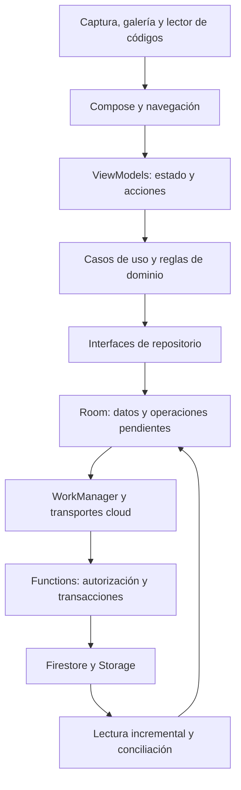

**FacturaStock: revisión profunda del estado actual — 8 de septiembre de 2026**

Esta revisión analiza el árbol de trabajo de `/Users/gustavo/Desktop/ProyectoMayda`, sobre el commit `0b2f23d`, incluidos los cambios sin commit y las optimizaciones recientes. Al comenzar había 148 archivos versionados modificados y 71 archivos sin seguimiento. Los informes anteriores se usaron como pistas; las conclusiones siguientes se contrastaron con el código y ejecuciones actuales.

**Mi diagnóstico es que la base técnica es sólida, pero todavía hay problemas de integridad y autorización que conviene resolver antes de una nueva distribución cloud.** Las defensas más importantes ya existen —transacciones, versiones, identidades durables, aritmética exacta—, pero no todas las entradas del producto llegan a ellas. El riesgo principal es que una operación correcta por una pantalla sea insegura por otra.

La revisión reprodujo ocho defectos: cuatro con Room real, tres con Firebase Emulator y uno de accesibilidad con Compose en Android. También identificó dos carencias del flujo de revisión OCR por inspección de contratos, navegación y persistencia. Las pruebas unitarias pasan, pero seis pruebas Android existentes fallan y la auditoría npm supera el umbral de severidad alta utilizado por CI. Pasar las suites actuales no descarta los escenarios reproducidos.

**El producto y su arquitectura.** FacturaStock organiza compras, ventas, inventario, lectura de facturas, catálogo y cuentas por cobrar. Es Android nativo con Kotlin, Compose, Material 3, Hilt, Room, CameraX, ML Kit y WorkManager. Los módulos Gradle son `app` y `benchmark`; las capas de la aplicación se separan principalmente por paquetes, interfaces y verificaciones estáticas.

El diagrama representa la ruta habitual de Functions. La variante `local` elimina INTERNET; `cloud` incorpora Firebase opcional. Existe además un modo Spark con escrituras directas y reglas distintas, que amplía la matriz de comportamientos que mantener. La lectura OCR y su normalización son locales. Ingresar productos desde una factura escaneada y publicar una compra contable son recorridos con contratos diferentes.

La medición de fuentes encontró 600 archivos Kotlin de producción, con 133.633 líneas, y 330 archivos Kotlin de pruebas, con 110.802 líneas. Functions contiene 11 archivos JavaScript productivos, con 8.024 líneas, y 14 archivos de pruebas. Room está en versión 28 y tiene 34 entidades. Estos tamaños describen el alcance; no son puntuaciones de calidad. El [inventario de medidas](/Users/gustavo/Desktop/ProyectoMayda/build/reports/revision-actual-2026-09-08/project-stats.json) conserva el criterio y los archivos mayores.

**Lo que está bien resuelto.** El dominio utiliza `Money` con unidades menores enteras y `BigDecimal` para cantidades y costos. Compras valida el documento preparado y escribe líneas, saldos, movimientos, auditoría y outbox en una transacción. Room tiene migraciones explícitas, claves de pertenencia y reglas SQL para proteger el historial; la configuración productiva registra la cadena hasta v28. [Publicación de compras](/Users/gustavo/Desktop/ProyectoMayda/app/src/main/java/com/facturastock/app/data/local/dao/PurchasePostingDao.kt:86), [builder de la base](/Users/gustavo/Desktop/ProyectoMayda/app/src/main/java/com/facturastock/app/data/local/FacturaStockDatabase.kt:1602).

Las rutas nuevas de edición y registro comprueban versiones, costos y si el negocio está enlazado. El ingreso OCR guarda un recibo durable junto con el stock y elimina el borrador dentro del mismo commit, lo que evita repetir el ingreso por un reintento. Ventas conserva una intención de checkout antes de la operación remota. El problema no es la ausencia de estas garantías, sino su aplicación incompleta a las rutas alternativas. [Edición protegida](/Users/gustavo/Desktop/ProyectoMayda/app/src/main/java/com/facturastock/app/data/repository/RoomProductEditingRepository.kt:212), [commit OCR](/Users/gustavo/Desktop/ProyectoMayda/app/src/main/java/com/facturastock/app/data/repository/RoomInvoiceMatchingCommitRepository.kt:225).

En privacidad hay permisos acotados, imágenes retenidas cifradas, bloqueo opcional y `FLAG_SECURE`. El manifiesto desactiva las copias automáticas de Android y la inicialización automática de Firebase; los diagnósticos requieren consentimiento. Functions revalida membresía dentro de transacciones, aplica App Check fuera del emulador y conserva trabajo recuperable para borrar cuentas y documentos. No se encontró material de credenciales de alta confianza con el escáner del repositorio. Esto no equivale a certificar toda la seguridad ni a verificar una configuración desplegada.

**P1 — Guardar un cambio de nombre puede reponer unidades ya vendidas.** El editor antiguo de Catálogos precarga la cantidad y, después de guardar el producto, llama a `setStock` aunque el usuario no haya modificado esa cantidad. `setStock` lee el saldo actual y calcula una diferencia, pero no recibe la versión que vio el formulario.

Escenario de UI: abrir formulario con 5 unidades, vender 2 y guardar el nombre. La reproducción con repositorios reales conserva la cantidad inicial, publica la venta y reenvía esa cantidad mediante `setStock`, la llamada usada por Catálogos: el saldo pasa de 3 nuevamente a 5 y aparece un ajuste de +2. La conexión con guardar metadatos se confirmó por inspección del ViewModel; la reproducción no automatizó ese formulario. La transacción y el CAS internos funcionan, pero ejecutan una intención desactualizada. El editor nuevo de Inventario ya dispone del contrato apropiado; hay que dirigir también los otros accesos hacia él y distinguir cambios de metadatos de ajustes explícitos. [Precarga](/Users/gustavo/Desktop/ProyectoMayda/app/src/main/java/com/facturastock/app/feature/catalogs/CatalogsViewModel.kt:756), [guardado legacy](/Users/gustavo/Desktop/ProyectoMayda/app/src/main/java/com/facturastock/app/feature/catalogs/CatalogsViewModel.kt:950), [diferencia aplicada](/Users/gustavo/Desktop/ProyectoMayda/app/src/main/java/com/facturastock/app/data/repository/RoomProductInventoryRepository.kt:68).

**P1 — Esa ruta puede cambiar stock compartido sólo en el celular.** `setStock` y su ajuste no comprueban `cloud_business_bindings` ni publican una operación remota de inventario. En la reproducción, un negocio enlazado pasa de 5 a 20 unidades localmente sin crear outbox. El guardado de metadatos del formulario puede producir una operación de catálogo, pero no una autorización ni un evento equivalente de stock.

Esto divide las existencias locales y remotas; una conciliación posterior puede sustituir el saldo mostrado. La protección debe vivir en la frontera de escritura, porque deshabilitar un campo en una pantalla deja abiertas las demás entradas. [Escritura sin guardia cloud](/Users/gustavo/Desktop/ProyectoMayda/app/src/main/java/com/facturastock/app/data/repository/RoomProductInventoryRepository.kt:60), [movimiento local](/Users/gustavo/Desktop/ProyectoMayda/app/src/main/java/com/facturastock/app/data/repository/RoomProductInventoryRepository.kt:229).

**P1 — Un administrador expulsado puede recuperar acceso mediante una invitación pendiente.** Se reprodujo con Auth REST y callables: un ADMIN cambia y verifica su correo, se invita al nuevo correo como ADMIN y luego el OWNER elimina su membresía. El usuario acepta esa invitación y vuelve a aparecer como ADMIN sin una nueva decisión del OWNER.

La búsqueda de miembros y la cancelación de invitaciones dependen del correo guardado en la membresía, que puede diferir del de Firebase Auth. Conviene ligar la autorización de las invitaciones a una identidad y generación de membresía verificables, e invalidarlas al revocar acceso. Actualizar únicamente el correo no resuelve todas las variantes entre cuentas. [Búsqueda por correo](/Users/gustavo/Desktop/ProyectoMayda/functions/membership.js:328), [revocación con correo anterior](/Users/gustavo/Desktop/ProyectoMayda/functions/membership.js:737), [recreación de membresía](/Users/gustavo/Desktop/ProyectoMayda/functions/membership.js:589).

**P2 — Costo desconocido se convierte en costo cero y ganancia completa.** El formulario antiguo permite introducir cantidad sin costo. `setStock` entrega `unitCost=null`; el primer saldo toma promedio cero y la venta congela ese promedio como costo histórico. El reporte pierde la distinción entre “no sé cuánto costó” y “fue gratuito”.

Reproducción: ingresar 5 unidades sin costo, vender 2 a S/5; el reporte devuelve costo S/0 y ganancia S/10, sin advertencias. Se necesita representar y propagar costo desconocido hasta la venta y los reportes, o exigir un costo explícito al ingresar stock. No basta con cambiar la etiqueta del reporte. [Cero inicial](/Users/gustavo/Desktop/ProyectoMayda/app/src/main/java/com/facturastock/app/data/repository/RoomProductInventoryRepository.kt:194), [conservación al faltar costo](/Users/gustavo/Desktop/ProyectoMayda/app/src/main/java/com/facturastock/app/data/repository/RoomProductInventoryRepository.kt:258), [costo de venta](/Users/gustavo/Desktop/ProyectoMayda/app/src/main/java/com/facturastock/app/data/repository/RoomSaleRepository.kt:845).

**P2 — Enlazar el negocio durante un checkout puede dejar una venta exclusivamente local.** La preparación lee que no hay enlace. Si el transporte decide `NotRequired`, el commit usa esa decisión anterior; sólo vuelve a comprobar el enlace cuando recibió una autorización remota. Mientras tanto, `bindOnce` puede crear el enlace sin revisar el checkout pendiente.

La reproducción intercala de forma determinista el enlace entre la decisión local y el commit: la venta se publica en Room, baja stock y desaparece la intención pendiente sin confirmación remota. El commit debe revalidar tanto la presencia como la ausencia del enlace, y el enlace inicial debe coordinarse con las operaciones pendientes. [Decisión anterior](/Users/gustavo/Desktop/ProyectoMayda/app/src/main/java/com/facturastock/app/data/repository/RoomSaleRepository.kt:489), [guardia condicionada](/Users/gustavo/Desktop/ProyectoMayda/app/src/main/java/com/facturastock/app/data/repository/RoomSaleRepository.kt:745), [creación del enlace](/Users/gustavo/Desktop/ProyectoMayda/app/src/main/java/com/facturastock/app/data/repository/RoomCloudBusinessBindingRepository.kt:75).

`RoomDebtRepository` presenta una ventana conceptual parecida para abonos al aceptar `NotRequired`; queda como escenario pendiente de reproducción, no como defecto independiente confirmado. [Abonos](/Users/gustavo/Desktop/ProyectoMayda/app/src/main/java/com/facturastock/app/data/repository/RoomDebtRepository.kt:99).

**P2 — Un almacén nuevo puede quedar bloqueado cuando el producto supera 100 movimientos.** La protección frente a historia legacy consulta hasta 101 movimientos y rechaza por tamaño antes de distinguir movimientos modernos. En negocios sin `bootstrapComplete`, 100 movimientos modernos permiten crear un saldo en otra ubicación; con 101 se obtiene `INVENTORY_HISTORY_SCAN_LIMIT`.

El bootstrap tampoco permite repararlo por el recorrido normal cuando ya existe `inventoryMetadata`. Hay que conservar explícitamente el estado de migración del inventario y separar esa decisión del tamaño de su historial. [Límite del barrido](/Users/gustavo/Desktop/ProyectoMayda/functions/inventorySync.js:477), [bootstrap rechazado](/Users/gustavo/Desktop/ProyectoMayda/functions/inventoryBootstrap.js:392).

**P2 — Spark admite eventos de venta huérfanos y malformados.** Un cliente autenticado como OWNER pudo escribir metadata de secuencia y un cambio `SALE` con `sale: {}` y `balances: []`, sin crear ninguna venta. Las reglas cruzan el evento con metadata, pero no exigen la venta y el conjunto correspondiente de escrituras.

El cliente oficial rechaza ese contenido al leerlo y no puede avanzar el cursor. El evento es inmutable desde el cliente, por lo que su reparación requiere intervención administrativa. El alcance demostrado es el negocio del propio OWNER; no se demostró acceso entre negocios. Si Spark se mantiene como modo soportado, sus invariantes deben ser verificables en reglas y probar batches incompletos. [Validación superficial](/Users/gustavo/Desktop/ProyectoMayda/firestore.spark.rules:487), [permiso de escritura](/Users/gustavo/Desktop/ProyectoMayda/firestore.spark.rules:1092), [lector que rechaza la venta](/Users/gustavo/Desktop/ProyectoMayda/app/src/cloud/java/com/facturastock/app/data/sync/FirebaseSaleWireMapper.kt:220).

**P2 — Crear producto queda bloqueado con letra grande y ventana compacta.** El diálogo contiene título, cuatro campos y botones dentro de una `Column` sin desplazamiento vertical. En una ventana de 720 × 480 dp y con el tamaño de letra del sistema en 200 %, la captura muestra el campo de cantidad recortado y los botones fuera del área visible. Una prueba de `assertIsDisplayed` sobre Guardar falla. Se necesita contenido desplazable, controles accesibles con teclado y pruebas sobre la escala real del sistema. [Diálogo](/Users/gustavo/Desktop/ProyectoMayda/app/src/main/java/com/facturastock/app/feature/matching/InvoiceMatchingScreen.kt:679), [captura del defecto](/Users/gustavo/Desktop/ProyectoMayda/build/reports/revision-actual-2026-09-08/matching-compact-system-font-200.png), [resultado de la prueba](/Users/gustavo/Desktop/ProyectoMayda/build/reports/revision-actual-2026-09-08/compact-system-font-200.log).

**Dos problemas adicionales del recorrido OCR, confirmados por inspección del código.** Primero, un producto creado durante la revisión permanece preparado en memoria hasta confirmar el lote. El buscador sólo consulta productos persistidos, y la vinculación exige `findById`. Si dos líneas corresponden al mismo producto nuevo, la segunda no puede reutilizar el creado en la primera. Hay que buscar y vincular también los productos preparados en esa revisión, preservando su identidad y procedencia; mezclarlos en los resultados de búsqueda por sí solo no basta. [Buscador](/Users/gustavo/Desktop/ProyectoMayda/app/src/main/java/com/facturastock/app/feature/matching/InvoiceMatchingViewModel.kt:239), [vinculación](/Users/gustavo/Desktop/ProyectoMayda/app/src/main/java/com/facturastock/app/feature/matching/InvoiceMatchingViewModel.kt:273), [producto preparado](/Users/gustavo/Desktop/ProyectoMayda/app/src/main/java/com/facturastock/app/feature/matching/InvoiceMatchingViewModel.kt:454).

Segundo, todas las líneas deben ser válidas para guardar, pero el contrato no permite eliminar un extra manual ni descartar explícitamente un falso positivo del OCR. Añadir una fila por error deja esa fila como obligación del lote. La solución es permitir eliminar extras manuales y registrar una decisión explícita, con motivo, para excluir una línea fuente; el repositorio debe validar esa decisión para que no se omitan datos silenciosamente. [Requisito de todas las líneas](/Users/gustavo/Desktop/ProyectoMayda/app/src/main/java/com/facturastock/app/feature/matching/InvoiceMatchingContract.kt:43), [acciones](/Users/gustavo/Desktop/ProyectoMayda/app/src/main/java/com/facturastock/app/feature/matching/InvoiceMatchingContract.kt:71), [validación del conjunto original](/Users/gustavo/Desktop/ProyectoMayda/app/src/main/java/com/facturastock/app/data/repository/RoomInvoiceMatchingCommitRepository.kt:108).

El formulario de producto nuevo también elige automáticamente la primera unidad y el primer almacén activos. Esta limitación está documentada; en un negocio con varias opciones conviene mostrar selectores o pedir una elección explícita. El ingreso OCR local se rechaza deliberadamente para negocios enlazados a cloud, porque carece de confirmación remota de stock. La interfaz debería informar esa limitación antes de invertir tiempo en captura y revisión. [Selección por orden](/Users/gustavo/Desktop/ProyectoMayda/app/src/main/java/com/facturastock/app/feature/matching/InvoiceMatchingViewModel.kt:401), [contrato documentado](/Users/gustavo/Desktop/ProyectoMayda/docs/INVOICE_PRODUCT_SCANNER.md:60).

**La recuperación completa sigue pendiente.** La exportación disponible declara `ACCOUNTING_LEDGER` y excluye cabeceras/líneas de ventas, deudas/pagos, fotos, borradores y otras categorías. El formato de snapshot integral tiene validador, journal y primitivas de archivos, pero `requestActivation()` siempre devuelve `NOT_READY`: falta detener escritores, cerrar Room, activar la copia y recuperar o revertir antes de volver a abrir la base.

Esta restricción evita hacer un reemplazo inseguro, pero significa que hoy no existe una recuperación integral utilizable por el usuario. Dado que las copias automáticas de Android están deshabilitadas, completar y probar recuperación en un dispositivo limpio tiene prioridad funcional alta. La sincronización parcial de negocio no sustituye una copia completa del estado local. [Exclusiones](/Users/gustavo/Desktop/ProyectoMayda/app/src/main/java/com/facturastock/app/domain/model/PrivacyModels.kt:413), [activación no disponible](/Users/gustavo/Desktop/ProyectoMayda/app/src/main/java/com/facturastock/app/data/restore/FullDeviceSnapshotRestoreReadiness.kt:224), [manifiesto](/Users/gustavo/Desktop/ProyectoMayda/app/src/main/AndroidManifest.xml:21).

**La evidencia de validación actual.** Se realizaron nuevas ejecuciones de las suites JVM de ambas variantes y pruebas Android en un AVD temporal API 35, usando exclusivamente datos sintéticos. Las reproducciones de stock, costo y checkout ejercitan repositorios con Room real; sus entradas desde UI se verificaron por inspección. No se instaló ni modificó la app en el dispositivo físico conectado. Los emuladores Firebase fueron locales; no se desplegó ni se consultaron datos del entorno productivo.

| Comprobación | Resultado | Qué acredita |
| --- | --- | --- |
| `ciStaticAnalysis`, baseline local `HEAD` | Aprobado | Formato y controles estáticos configurados; no es la totalidad de GitHub Actions. |
| Unitarias `localDebug`, ejecución forzada | 1.569 aprobadas, 0 fallos, 0 omisiones | Contratos JVM actuales. |
| Unitarias `cloudDebug`, ejecución forzada | 1.747 aprobadas, 0 fallos, 0 omisiones | Incluyen pruebas compartidas con local; no deben sumarse como cobertura única. |
| Android Lint local/cloud | 0 errores; 66 advertencias por variante | Predominan recursos sin uso y avisos de versiones; no todos requieren cambios. |
| Kover de dominio | 87,12 % de líneas; umbral 80 % aprobado | Sólo `domain.*`; cobertura de ramas 65,49 %, sin umbral equivalente. |
| Android, paquete de datos existente | 519 casos: 513 aprobados y 6 fallidos | Room real, migraciones, archivos, restauración, repositorios y sincronización local. |
| Reproducciones externas con Room | 4 de 4 reprodujeron el defecto | Estas pruebas afirman el comportamiento defectuoso; su aprobación no significa que esté corregido. |
| Android, selección de UI/navegación | 39 aprobadas, 0 fallos | Entrada del lector, revisión, inventario, recorrido de venta y recreación. |
| Comprobación adicional de accesibilidad | 1 prueba fallida: Guardar no visible | Ventana de 720 × 480 dp y fuente del sistema 200 %; confirmación visual del recorte. |
| Firebase estándar | 176 aprobadas, 0 fallos, 1 omitida | La prueba Spark se ejecuta separadamente. |
| Firebase Spark | 14 aprobadas, 0 fallos | Reglas de ese modo. |
| Reproducciones backend adicionales | 3 defectos reproducidos | Revocación, límite 100/101 y evento Spark huérfano. |
| Scripts de políticas, artefactos y ficha Play | Aprobados | Contratos automatizados del repositorio; no publicación real. |
| Escáner de secretos | Aprobado | Sin coincidencias de credenciales de alta confianza en los candidatos examinados. |

Las seis fallas Android existentes se explican por tres fixtures/configuraciones desactualizados:

- Dos pruebas de reemplazo de captura asignan un proveedor que no sembraron. Fallan por clave foránea preparando la prueba, antes de comprobar el reemplazo. [Fixture](/Users/gustavo/Desktop/ProyectoMayda/app/src/androidTest/java/com/facturastock/app/data/repository/InvoiceDraftRepositoryTest.kt:1198).
- Dos pruebas de integración del enlace registran migraciones sólo hasta 25, aunque la base actual es 28. La cadena productiva sí incluye las migraciones restantes. [Builder de prueba](/Users/gustavo/Desktop/ProyectoMayda/app/src/androidTest/java/com/facturastock/app/data/repository/RoomCloudBusinessBindingMigrationIntegrationTest.kt:180).
- Dos pruebas de preflight construyen una base actual y un manifiesto con el hash Room v27. Se rechaza la identidad antes de llegar a la aserción deseada. [Hash de fixture](/Users/gustavo/Desktop/ProyectoMayda/app/src/androidTest/java/com/facturastock/app/data/restore/FullDeviceSnapshotSQLitePreflightTest.kt:170).

Reparar esos fixtures es necesario para que vuelvan a probar lo que sus nombres prometen. No se deben debilitar las claves foráneas, saltar las pruebas ni habilitar migraciones destructivas para conseguir resultados verdes. El detalle de casos y excepciones está en [android-data-failures.json](/Users/gustavo/Desktop/ProyectoMayda/build/reports/revision-actual-2026-09-08/android-data-failures.json).

La comprobación inicial de accesibilidad modificaba únicamente `LocalDensity` en la composición y pasó: la ventana del diálogo conservaba su escala normal. Se conserva ese control en los artefactos, separado de la ejecución con `settings system font_scale=2.0`, que sí reprodujo el defecto y generó la captura relevante. El fallo adicional de accesibilidad es independiente de las seis fallas de fixtures existentes.

La cobertura alta de dominio convive con defectos en repositorios, autorizaciones y transiciones entre recorridos. Las regresiones con más valor son las que cruzan intención de UI, una escritura concurrente y resultado persistido; aumentar únicamente el porcentaje de líneas no prueba esas propiedades.

**Dependencias y entrega.** `npm audit` detectó 8 paquetes afectados: 1 de severidad alta y 7 moderados. La auditoría de producción queda en 1 moderado. El alto corresponde a `fast-uri@3.1.5`, transitivo de desarrollo a través de `firebase-tools → ajv`; la corrección de esa rama está en 3.1.6. El moderado productivo es `qs@6.15.3`, alcanzado por `firebase-functions → express`, también mediante `body-parser`; el aviso marca corrección en 6.16.0. Se verificaron los [avisos oficiales de fast-uri](https://github.com/fastify/fast-uri/security/advisories/GHSA-f65p-4m7j-42xc) y [qs](https://github.com/ljharb/qs/security/advisories/GHSA-4mjr-xmp4-gh2g).

Está confirmada la presencia de dependencias afectadas; no se demostró explotación de los callables ni SSRF en producción. El hallazgo alto de desarrollo basta para incumplir el comando actual `npm audit --audit-level=high` de CI. No se aplicaron actualizaciones automáticas. Las pruebas Firebase de esta máquina usaron Node 24.18 y Java 21; CI/Functions declara Node 22, por lo que queda verificar esa matriz exacta. [Auditoría total](/Users/gustavo/Desktop/ProyectoMayda/build/reports/revision-actual-2026-09-08/npm-audit.json), [auditoría productiva](/Users/gustavo/Desktop/ProyectoMayda/build/reports/revision-actual-2026-09-08/npm-audit-production.json), [umbral de CI](/Users/gustavo/Desktop/ProyectoMayda/.github/workflows/ci.yml:163).

La documentación contiene referencias desactualizadas: README y arquitectura todavía anuncian Room v27, mientras código y esquema exportado usan v28. El esquema 28 y otras piezas importantes siguen sin seguimiento en Git. Antes de evaluar reproducibilidad desde un clon limpio, conviene incluir esos archivos en commits coherentes y comprobar que la generación de esquemas no deja diferencias. No se crearon commits durante esta revisión.

**Rendimiento y mantenimiento.** Las optimizaciones recientes eliminan trabajo verificable: comparaciones antes de convertir filas Room, búsquedas cancelables fuera de Main, cancelación de observaciones de catálogo ocultas y procesamiento de píxeles por bloques. Son cambios razonables, pero esta revisión no vuelve a medir latencias físicas ni certifica los presupuestos de Macrobenchmark. El informe de optimización conserva limitaciones de Perfetto, por lo que sus resultados no justifican prometer una aceleración global.

El detalle de inventario todavía materializa todos los movimientos del producto, y el diagnóstico recorre saldos e historial dentro de una transacción. Su costo crece con la vida del negocio; conviene medir con un historial representativo y paginar antes de ampliar la carga. [Lectura de detalle](/Users/gustavo/Desktop/ProyectoMayda/app/src/main/java/com/facturastock/app/data/repository/RoomInventoryReadRepository.kt:86), [diagnóstico completo](/Users/gustavo/Desktop/ProyectoMayda/app/src/main/java/com/facturastock/app/data/repository/RoomInventoryReadRepository.kt:99).

La complejidad se concentra en archivos grandes: pantalla de revisión de líneas, 1.920 líneas; parser de totales, 1.858; `SalesViewModel`, 1.696; base Room, 1.678; navegación, 1.592. La primera separación útil sería extraer y unificar las operaciones de producto/stock, con un único contrato de permisos, versión, costo y publicación. La modularización puede seguir después; mezclar una reorganización general con correcciones de inventario dificultaría revisar el comportamiento final.

**Orden de trabajo recomendado y cómo verificar el cierre.**

| Prioridad | Trabajo concreto | Evidencia de cierre |
| --- | --- | --- |
| 1 | Unificar todas las altas/ediciones de stock y producto | Guardar un nombre conserva ventas concurrentes; toda entrada respeta la autoridad cloud. |
| 1 | Corregir revocación e invitaciones | Cambio de correo, expulsión e invitación anterior no recuperan membresía ni rol. |
| 2 | Propagar costo desconocido | Ventas y rentabilidad no muestran utilidad cierta cuando falta evidencia de costo. |
| 2 | Coordinar enlace cloud con checkout y revisar abonos | Ambas intercalaciones de enlace/confirmación conservan autorización y operación recuperable. |
| 2 | Resolver estado de migración de stock y reglas Spark | Pruebas 100/101/1.000, ubicación nueva y batches huérfanos mantienen integridad. |
| 2 | Completar corrección de líneas y reutilización de productos preparados | Una factura con producto repetido crea una sola identidad; extras y falsos positivos se corrigen explícitamente. |
| 2 | Hacer desplazable el diálogo de producto nuevo | Todos los campos y botones son operables con ventana compacta, teclado y fuente del sistema 200 %. |
| 2 | Reparar fixtures y dependencias | Las seis pruebas alcanzan sus aserciones; la auditoría cumple el umbral; repetir backend en Node 22. |
| 3 | Completar recuperación integral y selección de unidad/almacén | Restauración en dispositivo limpio, interrupción y rollback conservan registros y archivos; destino de stock explícito. |
| 3 | Consolidar documentación y medir crecimiento | Esquema y fuentes incluidos en Git; evidencia de lector físico, accesibilidad y rendimiento representativo. |

Los artefactos de esta revisión están en [el directorio de evidencia](/Users/gustavo/Desktop/ProyectoMayda/build/reports/revision-actual-2026-09-08), incluido [el resumen de validación](/Users/gustavo/Desktop/ProyectoMayda/build/reports/revision-actual-2026-09-08/validation-summary.json). Se añadieron este informe y artefactos de análisis. No se modificaron fuentes productivas ni dependencias y no se publicaron servicios. Las reproducciones externas se incorporaron mediante un init script de Gradle, sin agregarlas a las fuentes de la aplicación.
