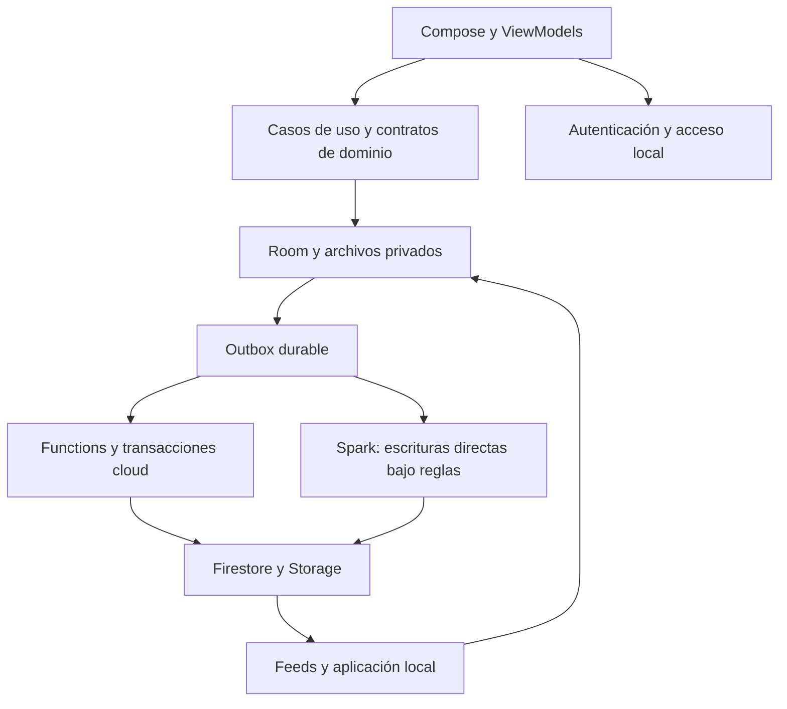

**FacturaStock — revisión técnica independiente del 19 de septiembre de 2026**

FacturaStock tiene una base técnica considerable y varias decisiones acertadas para proteger los datos. Sin embargo, conserva fallos de autorización, inventario y compatibilidad entre productores y consumidores de datos. Recomiendo estabilizar esos contratos antes de ampliar su uso entre teléfonos o usar sus reportes como única referencia de existencias y utilidad. La variante local también presenta problemas: desconectar Firebase no corrige la elección de unidades, la edición general de stock ni la anulación con monedas distintas.

La causa común más importante es que una operación válida para un componente puede resultar inválida para otro. Por ejemplo, el servidor acepta una compra que el lector Android no puede interpretar; el checkout acepta una venta que la anulación rechaza; el editor general de productos modifica stock con reglas distintas del editor de Inventario. Más pruebas aisladas o más comprobaciones de formato no bastarán si no se prueban esas combinaciones.

Esta revisión corresponde al commit `e1d03a2`. El archivo `docs/ANALISIS_PROFUNDO_2026-09-19.md` ya existía sin seguimiento al comenzar: se conservó intacto, se contrastaron sus principales conclusiones y se añadieron reproducciones independientes. No se modificaron fuentes productivas, reglas, dependencias ni datos de negocio. Este documento y la evidencia bajo `build/reports/revision-independiente-2026-09-19` son el resultado de la revisión.

**Producto y arquitectura observados.** Es una aplicación Android nativa en español, con Kotlin, Compose, Hilt, Room, CameraX y OCR local. El backend usa Firebase Auth, Firestore, Storage y Functions. Las versiones predeterminadas del código son 1.0.12, versionCode 13, Android mínimo API 26 y esquema Room 29. Existen dos módulos Gradle: `app` y `benchmark`; la separación del producto en dominio, persistencia, presentación y adaptadores ocurre principalmente mediante paquetes e interfaces dentro de `app`.

El flavor local elimina el permiso INTERNET y las dependencias Firebase. Cloud añade sincronización opcional, pero no convierte todas las operaciones en equivalentes: las compras se publican localmente y viajan mediante outbox, mientras las ventas y abonos de un negocio vinculado requieren autorización remota. El build type Spark usa otro protocolo, con escrituras directas, firma debug y depurabilidad; no debe evaluarse como si fuera cloudRelease.

El inventario independiente encontró 619 archivos Kotlin productivos o de soporte de variantes, con 140.748 líneas; 239 archivos Kotlin JVM de pruebas, con 71.858 líneas; 127 archivos Kotlin instrumentados, con 52.227 líneas; 11 archivos JavaScript productivos, con 8.024 líneas, y 14 archivos de pruebas backend, con 10.744 líneas. Incluye blancos y comentarios; excluye dependencias, fuentes generadas y el módulo benchmark. Hay 29 esquemas Room y siete casos del corpus dorado. Son medidas de tamaño, no de calidad o cobertura. [Conteo reproducible](/Users/gustavo/Desktop/ProyectoMayda/build/reports/revision-independiente-2026-09-19/source-metrics.json).

**El producto visible es más estrecho que el código disponible.** El menú vigente ofrece Vender, Inventario y Reportes. Home y Facturas redirigen a Vender. Persisten pantallas de compras, captura, cabecera y revisión, pero no encontré un acceso normal desde el menú principal para iniciar todo ese recorrido. La lista de compras conserva la acción de nueva compra, aunque sus entradas restantes son limitadas o de recuperación de navegación. Esto parece una simplificación deliberada de interfaz; el problema es que README y parte de la documentación siguen describiendo una experiencia más amplia. No se debe confundir que una clase compile o una ruta exista con que la función sea descubrible y esté integrada en el producto actual. [Menú actual](/Users/gustavo/Desktop/ProyectoMayda/app/src/main/java/com/facturastock/app/navigation/AppRoutes.kt:290), [redirecciones](/Users/gustavo/Desktop/ProyectoMayda/app/src/main/java/com/facturastock/app/navigation/FacturaStockApp.kt:582).

**Fortalezas verificadas.** El proyecto contiene controles que conviene preservar durante cualquier corrección:

- Dinero en unidades menores y cantidades/costos con BigDecimal, límites de precisión y redondeo explícito. Los problemas detectados son principalmente de significado, procedencia y compatibilidad del dato.
- Room usa WAL, migraciones explícitas y esquemas históricos. Hay claves foráneas, CAS por versión, controles de pertenencia al negocio y triggers de historia inmutable.
- La compra agrupa documento, líneas, movimientos, balances, auditoría y outbox dentro de una transacción. Las anulaciones conservan los originales y agregan compensaciones.
- El checkout guarda intención durable, identidad de contenido y mecanismos de recuperación de confirmación remota perdida. Los abonos usan identidad, versión y transacción.
- La outbox tiene claims, vencimiento de leases, reintentos y dependencias causales. La sincronización no consiste en llamadas de red sin estado persistido.
- Blaze deniega escrituras cliente del negocio; las Functions derivan identidad de Auth y verifican membresía, roles, correo, estado del negocio y App Check fuera del emulador.
- El procesamiento de imágenes limita tamaño, protege rutas, limpia metadatos y conserva identidad de publicación. CameraX y OCR tienen gestión de ciclo de vida, cancelación y callbacks tardíos.
- CI contempla seguridad, pruebas, esquemas, instrumentación, rendimiento y validación de artefactos; las acciones están fijadas por commit y el wrapper tiene checksum.

**Cómo interpretar los hallazgos.** P1 significa que priorizaría la corrección por autorización o integridad del negocio. P2 identifica un fallo concreto más acotado de funcionamiento, disponibilidad o experiencia. “Reproducido” indica una ejecución de esta revisión; “trazado” indica verificación del código. Las reproducciones históricas se identifican expresamente. Ninguna prueba emulada certifica Firebase desplegado, IAM o comportamiento completo de un dispositivo físico.

**1. P1 — El bloqueo de la aplicación concede acceso cuando falla la comprobación de autenticación.**

MainActivity solicita `BIOMETRIC_STRONG | DEVICE_CREDENTIAL`. Si `canAuthenticate` devuelve cualquier valor diferente de SUCCESS, marca la sesión como desbloqueada y guarda `biometricLockEnabled=false`. Agrupa indisponibilidad temporal, combinación no soportada y otros errores en una recuperación que concede acceso sin autenticar. [Comprobación](/Users/gustavo/Desktop/ProyectoMayda/app/src/main/java/com/facturastock/app/MainActivity.kt:337), [desactivación](/Users/gustavo/Desktop/ProyectoMayda/app/src/main/java/com/facturastock/app/MainActivity.kt:380).

AndroidX documenta que esa combinación no es compatible con API 28–29, incluidas en el rango soportado. Durante esta revisión había una tablet conectada con API 29; sólo se consultaron sus propiedades, sin probar el bloqueo ni intervenir sus datos. La incompatibilidad se verificó por código y [documentación oficial de BiometricManager](https://developer.android.com/reference/androidx/biometric/BiometricManager).

Corregir separando autenticación, indisponibilidad y recuperación: mantener el bloqueo ante fallos, seleccionar mecanismos compatibles por API y exigir recuperación autenticada para desactivar una protección configurada. Probar errores transitorios y Android 9/10. Este hallazgo afecta el bloqueo adicional de la app; no demuestra eludir el bloqueo del sistema operativo.

**2. P1 — Guardar metadatos desde el editor general puede reponer unidades que ya se vendieron.**

El editor general precarga stock y, al guardar el producto, vuelve a aplicar `setStock` con aquella cantidad. Escenario: abrir un producto con 10 unidades, vender una mientras el formulario sigue abierto y guardar un cambio de nombre; se calcula un ajuste de +1 para devolverlo a 10. La versión del producto no detecta la modificación del saldo. Además, producto y ajuste se guardan en operaciones separadas. [Precarga](/Users/gustavo/Desktop/ProyectoMayda/app/src/main/java/com/facturastock/app/feature/catalogs/CatalogsViewModel.kt:943), [guardado](/Users/gustavo/Desktop/ProyectoMayda/app/src/main/java/com/facturastock/app/feature/catalogs/CatalogsViewModel.kt:1151), [ajuste absoluto](/Users/gustavo/Desktop/ProyectoMayda/app/src/main/java/com/facturastock/app/data/repository/RoomProductInventoryRepository.kt:60).

El camino sí está disponible actualmente: Inventario → registro manual → cancelar el alta → lista de Catálogos → seleccionar producto → Editar. El alta manual no lleva los indicadores de origen que hacen volver al lector; cancelar deja visible el catálogo. El editor directo de Inventario usa otra implementación con snapshot y protecciones adicionales. No corresponde atribuir el defecto a todos los editores por igual.

La variante general tampoco impide este ajuste local en un negocio vinculado ni genera una operación cloud de inventario. Cambiar la ubicación no constituye una transferencia compensada. Verificación por trazado completo de navegación, formulario y repositorio; no se ejecutó la carrera en Android.

Corregir centralizando las mutaciones: guardar nombre/precio no debe cambiar existencias; un ajuste requiere intención explícita y versión del saldo; una transferencia debe conservar el total entre ubicaciones. Todas las entradas deben respetar la misma política cloud.

**3. P1 — La revocación de un administrador no invalida todas las autorizaciones pendientes que permiten su regreso.**

La cancelación de invitaciones se basa en el email guardado en la membresía. Si un ADMIN cambia y verifica su correo, se deja una invitación al nuevo correo y después OWNER lo expulsa, esa invitación puede sobrevivir. Aceptarla recupera el rol ADMIN: la aceptación no comprueba la vigencia de la autorización del invitador. [Revocación](/Users/gustavo/Desktop/ProyectoMayda/functions/membership.js:737), [aceptación](/Users/gustavo/Desktop/ProyectoMayda/functions/membership.js:576).

Se revalidó el recorrido por código. La reproducción HTTP del informe anterior sigue disponible y registra `recoveredRole: ADMIN`; no se ejecutó nuevamente ese escenario en esta revisión. [Evidencia previa identificada](/Users/gustavo/Desktop/ProyectoMayda/build/reports/analisis-2026-09-19/blaze-reproductions.json).

Corregir vinculando invitación, identidad y vigencia del permiso que la originó. Revocar la membresía debe invalidar las autorizaciones pendientes pertinentes. Actualizar solamente el email almacenado deja sin resolver la causalidad de la invitación.

**4. P1 — Functions acepta datos de compra que bloquean al consumidor Android. Hallazgo nuevo reproducido.**

Se publicaron como OPERATOR dos compras con producto existente: una con fecha `2026-02-31` y otra con moneda `ZZZ`. Ambas devolvieron RECORDED y aparecieron en el feed. El servidor sólo valida la forma mediante expresiones regulares; Android requiere una fecha real y una moneda reconocida. [Validación de servidor](/Users/gustavo/Desktop/ProyectoMayda/functions/index.js:464), [mapper Android](/Users/gustavo/Desktop/ProyectoMayda/app/src/cloud/java/com/facturastock/app/data/sync/SyncPullMappers.kt:201).

Un harness ejecutó el mapper Android compilado con las páginas exactas obtenidas por HTTP: ambas lanzan AccountException. Corregir exclusivamente la fecha o la moneda hace pasar los controles. El cliente no consigue una página válida para avanzar su cursor; la moneda inválida también queda en el balance remoto. Requiere un escritor autorizado o cliente defectuoso/manipulado y afecta su negocio; no se demostró acceso entre negocios. [Respuestas y controles](/Users/gustavo/Desktop/ProyectoMayda/build/reports/revision-independiente-2026-09-19/backend/VALIDACION.md).

Corregir con validación semántica compatible en ambos extremos y pruebas productor→consumidor. La solución también necesita tratamiento de registros inválidos ya persistidos, no sólo rechazar nuevas solicitudes.

**5. P1 — El feed de compras y el cliente discrepan sobre qué significa una secuencia.**

El servidor conserva un documento por purchaseId y lo reemplaza al anular. El cliente exige recibir secuencias consecutivas y que la reconciliación cubra íntegramente desde 1. Alta en secuencia 1 seguida de anulación en 2 puede dejar un primer pull con sólo `[2]`, que el cliente rechaza indefinidamente. Afecta a un teléfono nuevo o desconectado durante ambos cambios. [Documento mutable](/Users/gustavo/Desktop/ProyectoMayda/functions/index.js:1083), [sobrescritura](/Users/gustavo/Desktop/ProyectoMayda/functions/index.js:1559), [contigüidad y reconciliación](/Users/gustavo/Desktop/ProyectoMayda/app/src/main/java/com/facturastock/app/domain/usecase/SyncUseCases.kt:307).

La respuesta HTTP `[2]` está en la evidencia anterior. En esta revisión se repitieron las caracterizaciones JVM del consumidor, incluyendo el control que ya tenía cursor 1. Corregir exige elegir un contrato completo: eventos inmutables o réplica del último estado. Quitar una sola comprobación de contigüidad dejaría incompatibilidades en cache y reconciliación.

**6. P1 — Un pull puede borrar del saldo el efecto de una compra local pendiente.**

Escenario: saldo compartido 10; A publica localmente una compra +5 cuyo envío queda pendiente/conflictivo; B vende 2; el snapshot remoto es 8. El aplicador de A reemplaza 15 por 8 mientras la compra y su movimiento +5 siguen publicados localmente. Un envío posterior exitoso podría recuperar el efecto; un conflicto sin resolver puede prolongar la incoherencia.

El código sustituye cantidad y costo sin incorporar operaciones locales pendientes. El worker hace pull aunque la pasada de envío deje operaciones pendientes, reintentos o conflictos; también hay pull manual. [Aplicación del saldo](/Users/gustavo/Desktop/ProyectoMayda/app/src/main/java/com/facturastock/app/data/repository/RoomSharedInventoryApplicationRepository.kt:300), [worker](/Users/gustavo/Desktop/ProyectoMayda/app/src/main/java/com/facturastock/app/data/sync/PurchaseBackupSyncWorker.kt:396). Trazado independiente; falta prueba integrada de dos instalaciones.

Corregir separando saldo remoto confirmado de efectos pendientes y reconciliándolos por identidad, o introduciendo una barrera causal completa por posición afectada. “Enviar antes de descargar” no cubre conflictos, errores ni escrituras concurrentes.

**7. P1 — Las compras remotas no validan todas sus referencias de catálogo.**

`postPurchase` no incluye los productos de sus líneas en las lecturas transaccionales. La reproducción anterior muestra RECORDED para un producto declarado EXISTING que no tiene documento de catálogo, con creación de balance. Android necesita resolverlo para aplicar el evento; el error puede impedir avanzar la página. [Lecturas de servidor](/Users/gustavo/Desktop/ProyectoMayda/functions/index.js:1099), [resolución local](/Users/gustavo/Desktop/ProyectoMayda/app/src/main/java/com/facturastock/app/data/repository/RoomSharedInventoryApplicationRepository.kt:745).

Se contrastó el código y la evidencia histórica; no se repitió ese HTTP. Corregir verificando existencia, pertenencia y estado de referencias dentro de la transacción, con dependencias explícitas catálogo→compra y tratamiento recuperable si falta publicar una entidad.

**8. P1 — Registrar un producto por kilos cambia la unidad implícita de altas convencionales.**

El alta especial crea KGM; las unidades se ordenan por código y el alta de un código nuevo toma la primera activa. KGM precede a NIU. Después de registrar arroz por kilos, un nuevo producto de botellas puede nacer en kilogramos sin una elección explícita. [Creación](/Users/gustavo/Desktop/ProyectoMayda/app/src/main/java/com/facturastock/app/feature/catalogs/CatalogsViewModel.kt:789), [elección](/Users/gustavo/Desktop/ProyectoMayda/app/src/main/java/com/facturastock/app/feature/catalogs/CatalogsViewModel.kt:880), [orden SQL](/Users/gustavo/Desktop/ProyectoMayda/app/src/main/java/com/facturastock/app/data/local/dao/UnitDao.kt:35).

Se repitió la caracterización con el ViewModel real y repositorios fake que demuestra el comportamiento; no equivale a una prueba Room/dispositivo. Matching repite una elección implícita equivalente. Corregir definiendo la unidad convencional explícitamente y confirmando unidades cuando su origen no sea inequívoco.

**9. P1 — La ausencia de costo se convierte en cero y puede inflar utilidad.**

El alta general permite cantidad sin costo. El ajuste inicia el promedio en cero y lo conserva cuando `unitCost` es nulo. El checkout luego registra ese promedio como costo histórico conocido y el reporte admite cero. Ejemplo: ingresar tres unidades sin costo registrado y vender una por S/10 puede presentar utilidad S/10. [Promedio inicial](/Users/gustavo/Desktop/ProyectoMayda/app/src/main/java/com/facturastock/app/data/repository/RoomProductInventoryRepository.kt:194), [costo ausente](/Users/gustavo/Desktop/ProyectoMayda/app/src/main/java/com/facturastock/app/data/repository/RoomProductInventoryRepository.kt:258), [snapshot de venta](/Users/gustavo/Desktop/ProyectoMayda/app/src/main/java/com/facturastock/app/data/repository/RoomSaleRepository.kt:845).

Verificación por trazado. Se necesita conservar disponibilidad y procedencia del costo en balance e historia. Cero confirmado y costo desconocido son estados distintos. Corregir sólo el texto del reporte no restituye la información que ya se perdió.

**10. P2 — Una venta aceptada con costo en otra moneda no puede anularse. Hallazgo nuevo reproducido en SQLite.**

El checkout local acepta stock cuyo costo está en USD y una venta en PEN; conserva correctamente la moneda del costo y el reporte marca que no puede calcular una utilidad comparable. Sin embargo, anular exige moneda de movimiento y de saldo igual a la moneda de venta. Los triggers también imponen esa incompatibilidad. [Checkout](/Users/gustavo/Desktop/ProyectoMayda/app/src/main/java/com/facturastock/app/data/repository/RoomSaleRepository.kt:845), [rechazo al anular](/Users/gustavo/Desktop/ProyectoMayda/app/src/main/java/com/facturastock/app/data/repository/RoomSaleVoidRepository.kt:173), [trigger](/Users/gustavo/Desktop/ProyectoMayda/app/src/main/java/com/facturastock/app/data/local/SaleVoidPersistenceInvariants.kt:135).

Se reprodujo con SQLite en memoria, esquema Room v29 y 197 sentencias de invariantes obtenidas de clases productivas compiladas. El control PEN/PEN publica y anula; USD/PEN publica pero anular falla con `invalid stock movement graph`, queda stock 1 en lugar de 2 y no se crea recibo. Ambos pasan foreign_key_check. Es prueba de esquema e invariantes, no ejecución del repositorio Room en Android. [Evidencia y procedimiento](/Users/gustavo/Desktop/ProyectoMayda/build/reports/revision-independiente-2026-09-19/currency-void/README.md).

Corregir separando moneda de cobro/deuda de moneda de restitución del costo. Si el producto decide no admitir este caso, debe rechazarlo antes de publicar. Hay que alinear repositorio y triggers. La moneda de una factura puede diferir de PEN; no se afirma que Ajustes permita cambiar la moneda global, pues actualmente la muestra como sólo lectura.

**11. P2 — Una fecha futura se propaga a ventas posteriores. Hallazgo nuevo reproducido.**

El servidor usa el máximo entre su reloj, el postedAt enviado por el cliente y las fechas de los balances. Se envió una venta con fecha 2099-01-01 y luego otra venta normal del mismo producto: ambas quedaron fechadas en 2099. El saldo conserva esa fecha y la propaga; las ventas posteriores pueden desaparecer de reportes del día/mes actual, cuyos filtros usan postedAt. [Cálculo](/Users/gustavo/Desktop/ProyectoMayda/functions/saleSync.js:791), [filtro de reporte](/Users/gustavo/Desktop/ProyectoMayda/app/src/main/java/com/facturastock/app/data/local/dao/SaleDao.kt:108), [respuestas HTTP](/Users/gustavo/Desktop/ProyectoMayda/build/reports/revision-independiente-2026-09-19/backend/reproductions.json).

Corregir separando fecha comercial, confirmación del servidor y orden causal; la secuencia ya proporciona orden. No usar un timestamp remoto sin límites para fijar fechas comerciales de operaciones ajenas posteriores.

**12. P2 — Reportes puede quedar mostrando el período anterior tras medianoche. Hallazgo nuevo reproducido.**

Si la primera consulta comienza antes de medianoche y termina después, el ViewModel publica el rango vencido. El programador de refresco detecta que ya no queda tiempo y retorna, dejando la pantalla sin temporizador. Una caracterización con ViewModel y caso de uso reales confirmó que conserva el período anterior incluso después de avanzar 24 horas virtuales; un evento Resumed explícito lo corrige. [Temporizador](/Users/gustavo/Desktop/ProyectoMayda/app/src/main/java/com/facturastock/app/feature/reports/ReportsViewModel.kt:515), [prueba ejecutada](/Users/gustavo/Desktop/ProyectoMayda/build/reports/revision-independiente-2026-09-19/reproductions/ReportsMidnightCharacterizationTest.kt).

No significa que todo cambio de día falle: el caso requiere emisión inicial tardía y pantalla continuamente activa. Corregir reabriendo una consulta cuyo período ya expiró, con una protección explícita contra bucles. La prueba existente cubría el cruce con Resumed, que es una condición distinta.

**13. P2 — El campo del escáner atrapa navegación por teclado.**

El EditText consume Tab y Shift+Tab aunque esté vacío. El ensamblador HID intenta dejar pasar un terminador sin lectura pendiente, pero el campo vuelve a consumirlo. Dado que recibe foco automáticamente, dificulta abandonar el campo mediante teclado físico. [Campo nativo](/Users/gustavo/Desktop/ProyectoMayda/app/src/main/java/com/facturastock/app/feature/common/ScannerCodeInput.kt:347). Verificado por trazado; no se ejecutó con teclado real.

Corregir distinguiendo el terminador de un escaneo en curso de navegación con buffer vacío, respetando modificadores. La prueba adecuada debe atravesar Activity, router y EditText; probar cada pieza por separado deja pasar esta contradicción.

**Otras discrepancias relevantes, con alcance acotado.**

- Matching proyecta cantidad y costo unitario, perdiendo descuento, impuesto y total de línea antes de valorar existencias. Una línea 10 × S/10 con descuento S/20 puede ingresar valorizada en S/100. El flujo también exige completar todas las filas y no ofrece una exclusión persistida para un falso positivo. [Proyección](/Users/gustavo/Desktop/ProyectoMayda/app/src/main/java/com/facturastock/app/domain/usecase/MatchScannedInvoiceLinesUseCase.kt:59), [cálculo](/Users/gustavo/Desktop/ProyectoMayda/app/src/main/java/com/facturastock/app/domain/usecase/InvoiceMatchingStockResolver.kt:54).
- Cuando se alcanza el flujo OCR, el éxito deriva a matching local; éste rechaza un negocio cloud vinculado y muestra que debe usarse una compra publicada, sin ofrecer allí una derivación que conserve la revisión. La guarda cloud es correcta; falta integrar el recorrido. No se presenta como camino principal actual porque la navegación de compras quedó restringida. [Destino OCR](/Users/gustavo/Desktop/ProyectoMayda/app/src/main/java/com/facturastock/app/feature/ocr/OcrViewModel.kt:191), [rechazo deliberado](/Users/gustavo/Desktop/ProyectoMayda/app/src/main/java/com/facturastock/app/data/repository/RoomInvoiceMatchingCommitRepository.kt:100).
- El diagnóstico reconstruye inventario desde movimientos locales, mientras el pull puede traer balances de compras sin materializar esos movimientos. Un equipo nuevo puede recibir stock 10 e historia local vacía y mostrar divergencia. Hay que distinguir réplica parcial de libro íntegro. [Diagnóstico](/Users/gustavo/Desktop/ProyectoMayda/app/src/main/java/com/facturastock/app/data/repository/RoomInventoryReadRepository.kt:279).
- El helper de inventario rechaza crear una posición nueva cuando encuentra más de 100 movimientos del producto y no existe marca de bootstrap completo; no restringe el escaneo al nuevo almacén ni distingue primero historia moderna. Se contrastó código y reproducción previa, sin nueva ejecución del escenario. [Límite](/Users/gustavo/Desktop/ProyectoMayda/functions/inventorySync.js:478).
- Las reglas Spark aceptan un feed SALE cuya venta sólo se comprueba como map y balances como list, sin exigir una venta real enlazada. El escenario huérfano fue reproducido en el informe anterior; en esta revisión se releyeron las reglas y se repitió la suite convencional Spark, que sigue pasando. Esto ilustra un hueco de pruebas; no es una debilidad de las reglas Blaze. [Regla](/Users/gustavo/Desktop/ProyectoMayda/firestore.spark.rules:500).

**Recuperación de datos: hay una limitación de producto importante.** La restauración integral no está terminada: el coordinador devuelve NOT_READY aun con candidato y recibo válidos porque falta detener coordinadamente los escritores y cerrar/activar Room. Hay productor, validación, journal y primitivas de sustitución, pero no un flujo completo utilizable. [Compuerta de activación](/Users/gustavo/Desktop/ProyectoMayda/app/src/main/java/com/facturastock/app/data/restore/FullDeviceSnapshotRestoreReadiness.kt:202).

Además, el manifiesto y las reglas de extracción excluyen backup automático y transferencia de dispositivo. Es una decisión de privacidad con consecuencias operativas: una instalación local perdida no tiene recuperación integral disponible. Sincronizar registros y exportar JSON/PDF no equivale a reconstruir compras, fotos, ajustes, borradores y libro local completo. El manual reconoce esta limitación. Antes de depender del producto como único registro, hace falta completar y ensayar recuperación desde una instalación nueva, incluidos fallo a mitad de activación, espacio insuficiente y validación posterior del libro.

**Dependencias y distribución.** El nuevo `npm audit` encontró 13 paquetes afectados: tres de severidad alta y diez moderada. Al excluir desarrollo quedan sharp, alta, y qs, moderada. Son paquetes afectados, no necesariamente 13 vulnerabilidades independientes. El gate de CI usa `--audit-level=high`, por lo que el lockfile actual no satisface esa condición. [Resultado completo](/Users/gustavo/Desktop/ProyectoMayda/build/reports/revision-independiente-2026-09-19/npm-audit.json), [sólo producción](/Users/gustavo/Desktop/ProyectoMayda/build/reports/revision-independiente-2026-09-19/npm-production-audit.json).

Sharp está fijado a 0.35.3 y el mantenedor publica corrección desde 0.35.4 para vulnerabilidades de libheif. El endpoint comprueba firma y formato JPEG, lo que restringe la exposición; no se demostró explotación en la aplicación. Debe actualizarse de forma controlada y volver a validar. No aplicar automáticamente una propuesta de npm que incluso puede sugerir cambios mayores o retrocesos de herramientas. [Advisory oficial de sharp](https://github.com/lovell/sharp/security/advisories/GHSA-rgj7-g3m4-5g8c), [advisory de qs](https://github.com/ljharb/qs/security/advisories/GHSA-4mjr-xmp4-gh2g).

**Mantenimiento y rendimiento.** SalesViewModel tiene 2.592 líneas; la navegación, 1.726; la base Room, 1.712; y varios archivos de UI superan 1.500. El archivo Gradle de la app también reúne numerosos controles y contratos. El tamaño no demuestra lentitud, pero aumenta el costo de comprobar que todas las entradas respetan las mismas reglas. La evidencia de duplicación aquí es funcional: editor general frente a especializado, valoración de matching frente a compra formal, validación de Functions frente al parser Android.

Conviene primero centralizar esos contratos y después extraer componentes de coordinación de venta, pago, escáner y registro de producto. Una división apresurada en muchos módulos no resolvería los fallos de datos. Mantener decisiones de negocio en puertos reutilizables y probar los protocolos completos reducirá más riesgo que una reorganización puramente estética.

El proyecto ya tiene paginación estable de reportes, trabajo fuera del hilo principal, índices y presupuestos de macrobenchmark. No se midió rendimiento físico en esta revisión. Los siete casos JVM del corpus dorado prueban OCR esperado→parser; no prueban que ML Kit extraiga ese texto desde fotografías reales. Tampoco una comprobación de presupuesto del script acredita que la app haya cumplido ese presupuesto en una tablet.

El historial Git contiene sólo dos commits amplios, lo que limita bisect y atribución de regresiones. README todavía describe Room v27 frente a v29 vigente y parte del alcance visible ha cambiado. Recomiendo separar contrato vigente, documentación histórica y evidencia de cada versión; evitar que un informe antiguo se interprete como certificación del estado actual.

**Validación de esta revisión.**

| Comprobación | Resultado | Límite de interpretación |
| --- | --- | --- |
| JVM local | 1.760 pruebas, 0 fallos/errores/omitidas | Ejecución nueva, sin reutilizar tareas Test |
| JVM cloud | 1.938 pruebas, 0 fallos/errores/omitidas | Comparte muchas pruebas con local; no sumar como casos únicos |
| Lint local/cloud | 0 errores, 75 advertencias por variante | Las tareas de análisis reutilizaron resultados válidos de Gradle |
| Kover local | Gate mínimo 80% aprobado | Filtra dominio; no acredita 80% de toda la app |
| ciStaticAnalysis | Aprobado | Baseline Spotless explícito HEAD^; hubo subtareas reutilizadas |
| Firebase Blaze | 176 aprobadas, 1 omitida, 0 fallos | Emuladores; no IAM ni App Check real desplegado |
| Firebase Spark | 14 aprobadas, 0 fallos | Ejecución separada con reglas Spark |
| Contratos de feed y KGM | Tres caracterizaciones aprobadas | PASS confirma los comportamientos defectuosos y su control |
| Reporte a medianoche | Una caracterización aprobada | Reloj virtual; ViewModel/caso de uso reales |
| Backend adversarial nuevo | Fecha inválida, moneda inválida y propagación de fecha futura reproducidas | HTTP autenticado en emuladores |
| Parser Android real | Rechaza ambas páginas inválidas; controles corregidos pasan | Harness sobre clases compiladas, sin dispositivo |
| Monedas y anulación | Control PEN/PEN anula; USD/PEN falla | SQLite en memoria con esquema e invariantes productivas |
| Scripts y assets | Pasan cinco suites Ruby, resolución de baseline y assets Play | Smoke del script usa dobles; no equivale a instalar release |
| Escáner de secretos | Sin credenciales de alta confianza detectadas | No certifica permisos de nube ni secretos fuera del alcance del scanner |
| npm audit | Falla: 13 paquetes afectados, dos de producción | No se aplicó audit fix |

Los XML de las suites completas se conservaron antes de ejecutar caracterizaciones. [Resumen de pruebas JVM](/Users/gustavo/Desktop/ProyectoMayda/build/reports/revision-independiente-2026-09-19/unit-test-summary.json), [log Gradle](/Users/gustavo/Desktop/ProyectoMayda/build/reports/revision-independiente-2026-09-19/gradle-verification.log), [evidencia backend](/Users/gustavo/Desktop/ProyectoMayda/build/reports/revision-independiente-2026-09-19/backend/VALIDACION.md).

Se usaron Java 21.0.11 y Node 24.18.0; el backend declara Node 22 y CI usa su propia matriz Java. Por ello la ejecución local no certifica equivalencia con todos los runtimes de distribución. Aunque había un dispositivo conectado API 29, no se instalaron paquetes ni ejecutaron pruebas sobre una instalación que puede contener información real. No se ejecutaron en esta revisión instrumentación Android, cámara física, teclado/lector real, TalkBack, benchmarks, firma o distribución. No se inspeccionó Firebase productivo.

**Hipótesis que no se elevaron a defectos confirmados.** El posible foco de teclado detrás del bloqueo necesita reproducción independiente; no se afirma un segundo bypass. La mutación de unidad de producto con stock está bloqueada por un trigger local: no hay evidencia de reinterpretación silenciosa local. Queda pendiente verificar si el servidor admite esa mutación y bloquea después su aplicación en Android. La pista de un límite de reportes de 366 días no corresponde al código vigente. Estas distinciones evitan heredar conclusiones incorrectas de lecturas parciales.

**Orden de trabajo recomendado y aceptación verificable.**

1. Cerrar autorización: un fallo biométrico nunca concede sesión; expulsar un administrador invalida las invitaciones pendientes pertinentes. Validar API 28/29 y cambio de correo.
2. Unificar inventario: guardar metadatos no altera cantidades; todas las entradas usan versión y política cloud; unidades se eligen explícitamente y costo desconocido permanece distinguible de cero.
3. Reparar contratos cloud: toda compra aceptada debe poder ser interpretada y aplicada por Android; referencias de catálogo válidas; alta→anulación→primer pull completa; operaciones pendientes conservan su efecto operativo.
4. Alinear venta, anulación y reportes: moneda de costo separada de moneda de cobro; reloj erróneo de un equipo no fecha ventas posteriores; cruce de medianoche actualiza el período sin intervención.
5. Resolver accesibilidad e integración: Tab/Shift+Tab navegables; matching conserva ajustes de valoración; el producto anuncia sólo flujos disponibles y ofrece salida útil cuando el negocio es cloud.
6. Corregir dependencias y completar recuperación: gate de seguridad verde con revisión del lockfile; restauración ensayada desde cero; pruebas instrumentadas y piloto del artefacto exacto que se pretende distribuir.

Las pruebas más valiosas para la siguiente etapa son las de secuencias entre componentes: editar→vender→guardar, registrar kilos→alta convencional, comprar USD→vender PEN→anular, publicar→anular→sincronizar teléfono nuevo, compra pendiente→evento remoto y expulsar→aceptar invitación. Esas secuencias verifican las garantías que hoy las suites verdes no aseguran.
